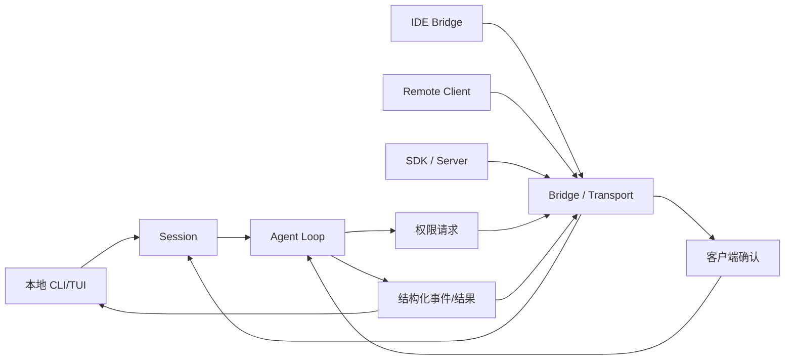

# IDE / Remote / Server Bridge

## 学习目标

这篇笔记分析 Claude Code 和当前 `coding-agent` 在 IDE、远程会话和 Server Bridge 上的差异，重点回答三个问题：

- CLI Agent 为什么会需要 IDE / Remote / Server 这类桥接层？
- 桥接层如何影响消息协议、权限回调和会话生命周期？
- 当前 `coding-agent` 为什么仍应把 CLI/TUI 本地执行作为主边界？

## 架构示意



## Claude Code 设计

Claude Code 的桥接层用于把核心 Agent 能力接到不同宿主：本地 CLI、IDE、远程会话、SDK、server transport 和移动/桌面入口。桥接层处理会话创建、消息收发、权限回调、附件传输、状态同步、连接恢复、远程认证和传输协议。

它的价值在于把“运行 Agent”从“某个终端进程”抽象成可被多个前端和远程环境驱动的会话。模型和工具循环仍是核心，但输入输出、权限确认和文件上下文可能来自 IDE、远端工作区或 SDK 调用方。

## 关键场景

- IDE 连接：IDE 提供当前打开文件、选择区、诊断信息和权限确认 UI。
- 远程会话：用户在本地发消息，Agent 在远端工作区运行工具，需要传输和认证。
- SDK / Server：外部程序调用 Agent，需要结构化事件、状态和错误返回。
- 权限回调：工具执行前的确认可能不在当前终端，而在 IDE 或远程客户端完成。

## 数据流 / 控制流

Claude Code 的抽象链路：

```text
客户端建立连接
-> 创建或恢复 session
-> 传入用户消息、附件和上下文
-> Agent Loop 产生事件、工具请求和权限请求
-> bridge 将事件发送给 IDE / Remote / SDK
-> 客户端返回权限决定或后续输入
-> session 状态同步和断线恢复
```

当前 `coding-agent` 的抽象链路：

```text
CLI / TUI 接收用户输入
-> parseConfig 读取环境变量和 flags
-> runSession / runAgentLoop
-> 本地 Harness 执行工具
-> 输出最终结果和事件文件
```

## 当前 coding-agent 实现对比

### 当前已实现

- `src/index.ts` 提供 CLI 入口，并剥离 `--auto-approve`、`--test-command`、`--max-retries`、`--verbose`、`--hooks-config` 等 flag。
- `src/tui/*` 提供基础 TUI 体验。
- `src/session.ts` 组织本地会话运行。
- 当前执行路径是本地 CLI/TUI 到本地 Harness，没有 IDE bridge、remote session 或 server 模式。

### 当前规划中

- P6 会话持久化可能为恢复会话打基础。
- P13 TUI 交互可继续增强本地前端体验。
- P11 子 Agent 可能需要更清晰的会话边界，但仍不等同于远程 bridge。

### 不适合当前阶段

- 当前不应描述成支持 IDE 连接、远程会话、SDK server 或权限远程回调。
- 不适合在没有协议需求时引入 WebSocket/SSE transport。
- 不适合把本地 observability event 当作完整 SDK 事件协议。

## 可以借鉴的设计

- 核心 Agent Loop 应保持与 UI/transport 解耦，让 CLI、TUI 或未来 SDK 可以复用。
- 权限确认接口应抽象成回调或策略，这样未来能接入不同前端。
- 会话恢复和事件输出应使用结构化格式，为未来 bridge 留下空间。
- 远程执行如果进入规划，必须重新审视工作目录边界、secret 管理和权限归属。

## 不应该照搬的设计

- 不应为了“像 IDE Agent”而提前实现 server transport。
- 不应让远程概念模糊当前真实边界：本项目现在是本地 CLI/TUI Agent。
- 不应把权限确认从 Harness 边界移到前端后就失去代码级校验。

## 参考文件

Claude Code：

- `<claude-code-snapshot>/src/bridge/`
- `<claude-code-snapshot>/src/remote/`
- `<claude-code-snapshot>/src/server/`
- `<claude-code-snapshot>/src/cli/transports/`
- `<claude-code-snapshot>/src/entrypoints/sdk/`

coding-agent：

- `src/index.ts`
- `src/session.ts`
- `src/tui/app.tsx`
- `src/harness.ts`
- `tests/index.test.ts`
