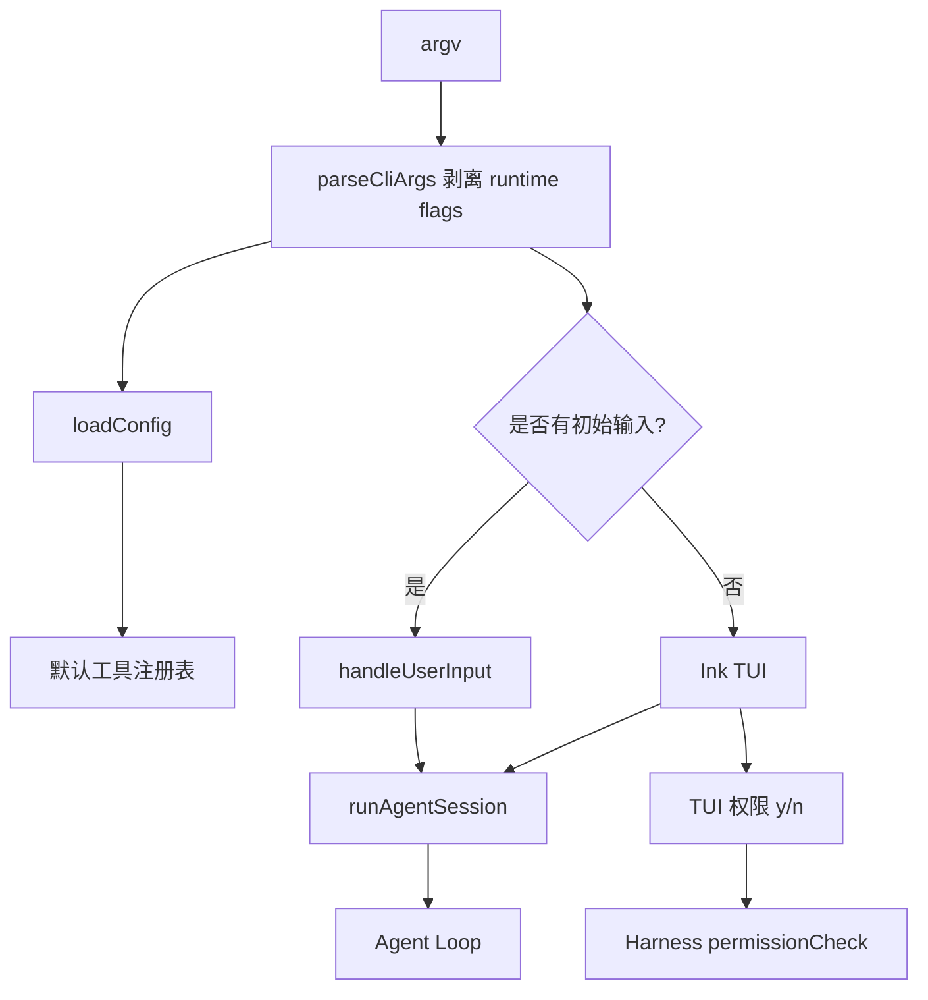

# CLI / TUI / Commands / Session

## 学习目标

这篇笔记分析 Claude Code 和当前 `coding-agent` 在 CLI、TUI、命令系统和会话体验上的差异，重点回答三个问题：

- CLI Agent 的入口为什么不只是读取一段 prompt？
- slash commands、TUI、权限提示和会话恢复如何影响 Agent 架构？
- 当前 `coding-agent` 已经具备哪些本地交互能力，哪些产品体验仍应留在规划中？

## 架构示意



## Claude Code 设计

Claude Code 的 CLI/TUI 层承担入口解析、REPL、slash commands、权限确认、帮助、状态展示、会话恢复、主题、快捷交互和诊断命令。它不仅把用户输入转给 Agent Loop，还要把工具执行、权限请求、模型输出、错误和会话状态呈现为可交互体验。

命令系统让用户可以在自然语言任务之外执行结构化操作，例如查看状态、管理配置、安装插件、处理 MCP、查看成本或恢复会话。TUI 层则把权限确认、进度、工具结果和多轮输出做成持续反馈。

## 关键场景

- 一次性 CLI：用户传入任务字符串，Agent 执行后输出结果。
- 交互式 REPL：用户连续输入，多轮会话复用历史和状态。
- slash command：用户执行 `/compact`、`/config`、`/permissions` 等非模型任务。
- 权限提示：工具执行前需要把风险和选项呈现给用户。

## 数据流 / 控制流

Claude Code 的抽象链路：

```text
解析 CLI 参数
-> 初始化配置、状态和 UI
-> 进入 REPL 或执行单次任务
-> 区分 slash command / 文本 prompt / bash mode
-> 对文本任务调用 Query
-> TUI 展示模型输出、工具进度和权限确认
-> 保存或恢复 session
```

当前 `coding-agent` 的抽象链路：

```text
src/index.ts 解析 argv
-> 剥离 CLI flags
-> parseConfig
-> CLI 或 TUI 入口创建 session
-> runAgentLoop
-> Harness 权限确认和工具执行
-> 输出结果
```

## 当前 coding-agent 实现对比

### 当前已实现

- 本地 npm bin 入口和 CLI 运行路径已经存在。
- `--auto-approve`、`--test-command`、`--max-retries`、`--verbose`、`--hooks-config` 会从用户任务中剥离，避免作为 prompt 传给模型。
- `src/tui/app.tsx` 提供基础 TUI。
- `src/session.ts` 组织会话运行。
- CLI 输入处理由 `tests/index.test.ts` 覆盖。

### 当前规划中

- P13 计划继续增强 TUI 交互体验。
- P6 计划会话持久化和恢复。
- P12 计划配置策略治理，可影响 CLI flag 和项目配置的关系。

### 不适合当前阶段

- 当前没有 Claude Code 级别的 slash command 生态、插件命令、主题系统或完整会话恢复。
- 当前不是完整 IDE Agent，也没有 GUI。
- 不应把基础 TUI 描述成成熟产品级交互层。

## 可以借鉴的设计

- CLI 入口应持续把结构化 flag 和用户 prompt 分离。
- 命令系统如果扩展，应区分“本地控制命令”和“交给模型的自然语言任务”。
- TUI 展示不应改变核心执行边界；权限、安全和验证仍在 Harness。
- 会话恢复应保存协议消息，而不是只保存屏幕输出。

## 不应该照搬的设计

- 不应一次性实现大量 slash commands。
- 不应让 UI 组件直接调用工具，绕过 Agent Loop 和 Harness。
- 不应在没有会话持久化前承诺可靠 resume 能力。

## 参考文件

Claude Code：

- `<claude-code-snapshot>/src/main.tsx`
- `<claude-code-snapshot>/src/commands.ts`
- `<claude-code-snapshot>/src/commands/`
- `<claude-code-snapshot>/src/replLauncher.tsx`
- `<claude-code-snapshot>/src/components/`
- `<claude-code-snapshot>/src/screens/`

coding-agent：

- `src/index.ts`
- `src/session.ts`
- `src/tui/app.tsx`
- `tests/index.test.ts`
- `tests/tui/app.test.tsx`
- `docs/plan/p13-tui-interaction.md`
