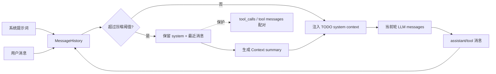

# Context / Memory / Compact

## 学习目标

这篇笔记分析 Claude Code 和当前 `coding-agent` 在上下文管理上的设计差异，重点回答三个问题：

- Agent 的上下文为什么不只是“把历史消息全塞给模型”？
- compact、memory、系统提示词和工具结果之间有哪些协议约束？
- 当前 `coding-agent` 应该怎样保持简化实现，同时避免破坏 tool call 配对？

## 架构示意



## Claude Code 设计

Claude Code 的上下文管理由多个来源组成：系统提示词、项目指令、会话历史、附件、git 状态、memory、Skill 发现结果、用户当前输入、工具结果和压缩摘要。它会根据 token budget 和产品场景构造当前轮发送给模型的消息视图。

核心不是单纯截断，而是在保留任务连续性的同时维护协议结构。特别是 assistant 的 tool use 和后续 tool result 必须成对保留，否则下一次模型请求可能因为历史不合法而失败。Claude Code 还会把一些上下文来源做成可恢复、可刷新或可折叠的结构，例如 compact retry、session memory、附件注入和项目指令变更。

## 关键场景

- 长任务：多轮读文件、编辑和测试后，历史过长，需要压缩早期对话但保留当前修复链路。
- 工具配对：如果压缩时留下 assistant tool use 却删除对应 tool result，后续 API 请求会违反协议。
- 项目指令：`CLAUDE.md`、系统提示词、当前工作目录和安全规则应作为高优先级上下文存在。
- 记忆与技能：成熟产品会把用户偏好、项目知识和技能发现结果注入上下文，但这些内容不应替代真实工具结果。

## 数据流 / 控制流

Claude Code 的抽象链路：

```text
读取系统提示词和项目上下文
-> 合并会话历史、附件、memory、skill 信息
-> 估算 token budget
-> 需要时 compact / collapse
-> 保护 tool_use / tool_result 配对
-> 构造当前轮 messages
-> 模型响应和工具结果写回历史
```

当前 `coding-agent` 的抽象链路：

```text
初始化 MessageHistory(system + user)
-> 每轮请求前调用 compressor
-> 保留系统提示词和最近消息
-> 保护 tool call / tool message 配对
-> 注入 TODO 状态作为额外 system context
-> 调用 LLM
-> assistant 和 tool message 写回历史
```

## 当前 coding-agent 实现对比

### 当前已实现

- `src/context/system-prompt.ts` 构造基础系统提示词和工具使用边界。
- `src/context/message-history.ts` 管理消息历史。
- `src/context/compressor.ts` 负责历史压缩，并要求保留系统提示词和最近消息。
- 上下文压缩必须保护 tool call / tool message 配对。
- TODO 状态只作为额外 system context 注入，不替代真实消息历史或工具结果。
- `tests/context/*.test.ts` 和 `tests/tools/todo-write.test.ts` 覆盖关键上下文行为。

### 当前规划中

- P6 计划会话持久化，可能让历史恢复和本地状态更完整。
- P12 计划配置策略治理，可能让项目级非敏感配置进入上下文来源。
- P11 子 Agent 如果落地，需要每个子 Agent 拥有独立消息历史，主 Agent 只接收摘要和结构化结果。

### 不适合当前阶段

- 当前没有真正的检索增强 RAG，不应把 memory 或 context 描述成检索系统。
- 当前没有 Claude Code 级别的 SessionMemory、settings sync、技能发现上下文和附件生态。
- 不适合为了模拟成熟产品而引入复杂 token budget continuation 状态机。

## 可以借鉴的设计

- compact 必须服务协议正确性，而不仅是缩短文本。
- 所有额外上下文都应有清晰优先级：系统提示词和安全边界高于临时状态。
- 后续如果加入会话持久化，应区分“历史消息”“摘要记忆”“项目配置”和“工具结果”四类来源。
- 对压缩后的消息应继续用测试证明 tool call 配对完整。

## 不应该照搬的设计

- 不应把未验证的长期记忆当作当前项目事实。
- 不应让 TODO 状态、摘要或 memory 覆盖真实工具结果。
- 不应在没有长期存储和迁移机制前实现复杂 memory schema。

## 参考文件

Claude Code：

- `<claude-code-snapshot>/src/context.ts`
- `<claude-code-snapshot>/src/services/compact/`
- `<claude-code-snapshot>/src/utils/messages.js`
- `<claude-code-snapshot>/src/services/SessionMemory/`

coding-agent：

- `src/context/system-prompt.ts`
- `src/context/message-history.ts`
- `src/context/compressor.ts`
- `src/session.ts`
- `tests/context/compressor.test.ts`
- `tests/context/message-history.test.ts`
