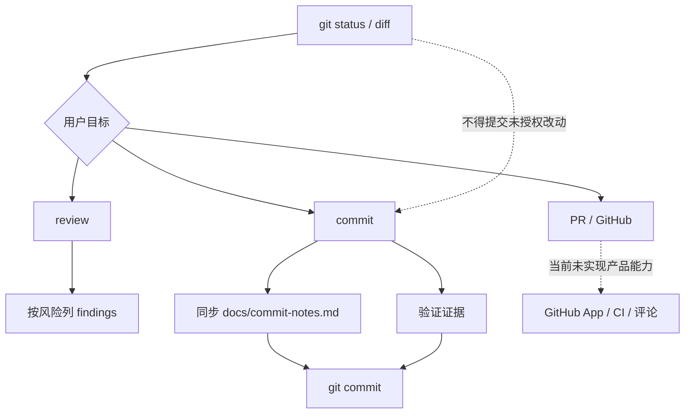

# Git / GitHub 工作流

## 学习目标

这篇笔记分析 Claude Code 和当前 `coding-agent` 在 Git / GitHub 工作流上的差异，重点回答三个问题：

- commit、diff、review、branch、PR 为什么会成为 Agent 产品的一部分？
- Git 工作流自动化需要哪些安全和可解释边界？
- 当前 `coding-agent` 已有哪些发布与复盘实践，哪些 GitHub 集成仍不属于现状？

## 架构示意



## Claude Code 设计

Claude Code 把 Git 和 GitHub 工作流作为用户日常开发体验的一部分：查看 diff、生成 commit、创建分支、处理 PR 评论、安装 GitHub App、做 review、执行安全审查和管理远程协作。这些能力不是简单调用 `git`，而是需要理解工作区状态、用户意图、提交边界、远程权限和自动化风险。

成熟 Agent 在 Git 工作流里要格外保守：不能误提交用户未授权改动，不能隐藏冲突，不能把未验证变更描述成已发布，不能在没有明确请求时做破坏性操作。

## 关键场景

- commit 生成：需要理解 diff、选择文件、写提交信息，并保留复盘材料。
- review：需要按严重程度列 bug、风险和缺失测试，而不是只总结改动。
- PR 工作流：创建 PR、检查 CI、回应评论，需要远程权限和状态读取。
- 冲突处理：如果目标是 rebase merge，应优先 rebase 目标分支逐个解冲突，而不是产生 merge commit。

## 数据流 / 控制流

Claude Code 的抽象链路：

```text
读取 git 状态和 diff
-> 判断用户目标：commit / review / branch / PR
-> 选择文件或远程对象
-> 执行 git / gh / API 命令
-> 展示结果、CI、评论或冲突状态
-> 保存会话和可复盘证据
```

当前 `coding-agent` 的实践链路：

```text
本地文件修改
-> 按任务运行测试或验证
-> git diff / status 检查
-> 如需 commit，同步更新 docs/commit-notes.md
-> git add / git commit
-> final 汇报验证结果和风险
```

## 当前 coding-agent 实现对比

### 当前已实现

- 仓库已有 `docs/commit-notes.md`，每次创建 commit 时必须同步记录主题、时间、Why / What / How。
- README、License、CONTRIBUTING、Issue/PR 模板和 demo 等开源发布打磨已完成。
- 当前不会自动执行 `npm publish`，也不应描述成已经完成 npm registry 发布运营。
- 本协作流程中会尊重用户未提交改动，不会随意 revert。

### 当前规划中

- P7 计划 diff 与验证闭环，可加强变更审查和验证证据。
- P5 已完成发布写作相关主线，但不等于 registry 运营。
- 未来如果集成 GitHub App 或 PR 自动化，需要单独权限、测试和文档边界。

### 不适合当前阶段

- 当前没有内置 GitHub App、PR 评论机器人、自动 review 平台或完整 Git 工作流命令系统。
- 不应把本地 `gh` 命令可用性描述成产品能力。
- 不应自动提交或推送，除非用户明确要求。

## 可以借鉴的设计

- Git 工作流应把“选择哪些改动进入提交”作为显式边界。
- review 输出应优先 bug、风险、行为回归和缺失测试。
- PR / CI 状态应来自真实命令或 API 证据，不用猜测。
- 冲突处理目标如果是 rebase merge，应避免默认 merge commit。

## 不应该照搬的设计

- 不应把 GitHub App、PR 评论和自动化发布提前纳入当前功能描述。
- 不应让 Agent 在未确认时执行 destructive git 操作。
- 不应用文档声称发布完成来替代真实 registry 发布证据。

## 参考文件

Claude Code：

- `<claude-code-snapshot>/src/commands/commit.ts`
- `<claude-code-snapshot>/src/commands/diff/`
- `<claude-code-snapshot>/src/commands/branch/`
- `<claude-code-snapshot>/src/commands/install-github-app/`
- `<claude-code-snapshot>/src/utils/git.js`

coding-agent：

- `docs/commit-notes.md`
- `docs/plan/p5-release-writing.md`
- `docs/plan/p7-diff-verification.md`
- `README.md`
- `.github/`
