# Architecture Notes

这里放 Claude Code 的跨模块架构学习笔记。每篇文章围绕一个架构问题展开：它解决什么场景、如何组织控制流、代价是什么、当前 `coding-agent` 是否需要类似设计。

## 主题地图

```mermaid
flowchart TD
  Runtime["运行时闭环"] --> Loop["Agentic Loop"]
  Runtime --> Tool["Tool Use 协议"]
  Runtime --> Context["Context / Compact"]
  Runtime --> Safety["Permission / Safety"]
  Extension["能力扩展"] --> Skill["Skill 系统"]
  Extension --> Service["MCP / LSP / API"]
  Extension --> Plugin["插件系统"]
  Extension --> SubAgent["Sub-agent"]
  Product["产品化连接"] --> Bridge["IDE / Remote / Server"]
  Product --> State["状态 / 记忆 / 配置"]
  Product --> CLI["CLI / TUI / Session"]
  Product --> IO["输入输出体验"]
  Product --> Git["Git / GitHub"]
  Product --> Obs["Observability / Eval"]
```

## 章节导航

- [Agentic Loop 与停止条件](/architecture/agentic-loop)
- [Tool Use 协议与执行链路](/architecture/tool-use-protocol)
- [Context / Memory / Compact](/architecture/context-compact)
- [Permission / Sandbox / Safety](/architecture/permission-safety)
- [Skill 系统与能力扩展](/architecture/skill-system)
- [MCP / LSP / API 服务层](/architecture/service-integrations)
- [插件系统与扩展治理](/architecture/plugin-system)
- [IDE / Remote / Server Bridge](/architecture/bridge-remote-server)
- [状态、记忆与配置治理](/architecture/state-memory-config)
- [CLI / TUI / Commands / Session](/architecture/cli-tui-session)
- [输入输出体验](/architecture/input-output-experience)
- [Git / GitHub 工作流](/architecture/git-github-workflow)
- [Observability / Eval / Trace](/architecture/observability-evals)
- [Sub-agent / Task / Coordinator](/architecture/sub-agent-orchestration)

## 写作要求

- 先描述 Claude Code 的设计，再描述当前 `coding-agent` 的实现边界。
- 对比时使用 `当前已实现`、`规划中`、`不适合当前阶段` 三类判断。
- 如果提出后续改进，必须能映射到具体模块或 `docs/plan/` 中的计划主题。
- 不要因为 Claude Code 具备某能力，就默认本项目应立即实现同等复杂度。
