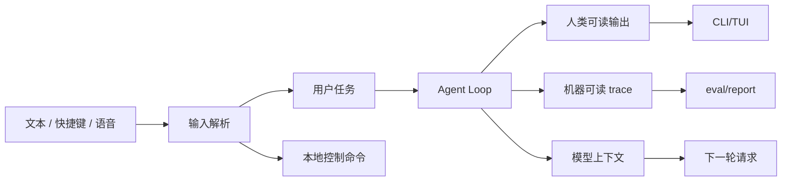

# 输入输出体验

## 学习目标

这篇笔记分析 Claude Code 和当前 `coding-agent` 在输入输出体验上的差异，重点回答三个问题：

- 输入输出体验为什么会影响 Agent 架构，而不只是 UI 细节？
- 结构化输出、快捷键、Vim、语音和 output style 分别解决什么问题？
- 当前 `coding-agent` 应该优先保障哪些 I/O 边界？

## 架构示意



## Claude Code 设计

Claude Code 支持多种输入输出形态：普通文本、slash commands、bash mode、快捷键、Vim 模式、语音输入、结构化 IO、NDJSON 安全序列化、输出风格和不同终端渲染路径。成熟 CLI 产品需要同时服务人类交互、脚本调用、IDE/SDK 连接和 trace 消费。

这些能力会反过来影响核心架构：输入解析要区分控制命令和 prompt；输出要区分用户可读文本、机器可读事件和模型上下文；结构化输出要避免破坏 JSON/NDJSON；快捷键和 TUI 状态要能中断、确认或继续任务。

## 关键场景

- 非交互运行：脚本希望稳定读取 stdout、stderr 或 NDJSON 事件。
- TUI 交互：用户需要看到工具进度、权限确认和最终回答。
- 快捷输入：Vim 或快捷键改变编辑体验，但不应改变任务语义。
- 输出风格：成熟产品可切换回复风格，但不能改变安全和工具协议边界。

## 数据流 / 控制流

Claude Code 的抽象链路：

```text
采集键盘 / 文本 / 语音 / 结构化输入
-> 解析为 command、prompt 或控制事件
-> Agent Loop 产生 stream、tool、permission、trace 事件
-> 渲染到 TUI、stdout、NDJSON 或远程 transport
-> 保存可恢复会话和机器可读记录
```

当前 `coding-agent` 的抽象链路：

```text
CLI argv 或 TUI 输入
-> 解析 flags 和 prompt
-> Agent Loop 执行
-> console 输出结果
-> observability 写 JSONL trace
```

## 当前 coding-agent 实现对比

### 当前已实现

- CLI 输入处理会剥离结构化 flag，避免污染 prompt。
- TUI 提供基础交互界面。
- observability JSONL trace 和 eval report 提供机器可读复盘材料。
- 输出和事件需要做敏感信息脱敏。

### 当前规划中

- P13 计划增强 TUI 交互。
- P4 已有 eval trace/report 基础，后续可继续改善结构化输出消费体验。
- 如果未来支持脚本化机器输出，应明确 stdout/stderr 和 trace 的稳定性边界。

### 不适合当前阶段

- 当前没有 Vim 模式、语音输入、output style 系统或完整 structured IO 协议。
- 当前没有 IDE/SDK 级事件流。
- 不应把 trace JSONL 描述成完整对外 API。

## 可以借鉴的设计

- 用户可读输出、模型上下文和机器可读事件应分层设计。
- 结构化输出要保证可解析，避免把彩色 TUI 文本混入机器通道。
- 中断、权限确认和工具进度应最终归入明确事件模型。
- 任何输出都不应泄露 `ARK_API_KEY`、Authorization、token、password、secret 或真实凭证。

## 不应该照搬的设计

- 不应优先实现语音、Vim 或多 output style，而忽视核心执行正确性。
- 不应让 UI 输出成为唯一可复盘证据。
- 不应让输入快捷模式绕过 CLI flag 剥离和权限确认。

## 参考文件

Claude Code：

- `<claude-code-snapshot>/src/keybindings/`
- `<claude-code-snapshot>/src/vim/`
- `<claude-code-snapshot>/src/voice/`
- `<claude-code-snapshot>/src/outputStyles/`
- `<claude-code-snapshot>/src/cli/structuredIO.ts`
- `<claude-code-snapshot>/src/cli/ndjsonSafeStringify.ts`

coding-agent：

- `src/index.ts`
- `src/tui/app.tsx`
- `src/observability/events.ts`
- `src/evals/report.ts`
- `tests/index.test.ts`
- `tests/observability/events.test.ts`
