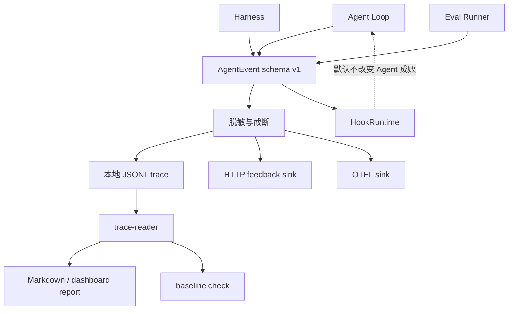

# Observability / Eval / Trace

## 学习目标

这篇笔记分析 Claude Code 和当前 `coding-agent` 在可观测性、评测和 trace 上的差异，重点回答三个问题：

- Agent 为什么需要事件、trace、成本和 eval，而不只看最终回答？
- 观测数据如何在复盘价值和敏感信息保护之间取平衡？
- 当前 `coding-agent` 的 eval 平台已经做到什么，哪些长期趋势不能夸大？

## 架构示意



## Claude Code 设计

Claude Code 的可观测能力覆盖成本跟踪、analytics、telemetry、hook、trace、会话事件、工具事件和产品反馈。成熟 Agent 需要知道每轮模型请求、工具调用、权限拒绝、错误、成本、耗时和用户反馈，才能定位质量问题和控制运营风险。

这些事件通常服务多类消费者：本地调试、产品分析、质量评估、hook 扩展、远程会话和长期趋势。越成熟的观测系统，越需要稳定 schema、脱敏策略、采样策略和失败隔离。

## 关键场景

- 工具失败复盘：需要知道哪个工具、什么输入摘要、什么错误，而不是只看到最终失败。
- 权限拒绝：需要记录拒绝原因和工具类别，用于调整策略。
- eval 回归：同一任务多次运行，比较 pass rate、turns、tool calls 和验证次数。
- 成本控制：模型调用和 token 使用需要被跟踪，但不能泄露用户敏感内容。

## 数据流 / 控制流

Claude Code 的抽象链路：

```text
Agent Loop / Tool / UI 产生事件
-> 统一事件 schema 和脱敏
-> 写入本地 trace 或发送 analytics
-> hook 或反馈系统消费事件
-> eval / dashboard 汇总质量指标
```

当前 `coding-agent` 的抽象链路：

```text
Agent Loop emit LLM request/response/stop
-> Harness emit tool/permission/verification events
-> EventRecorder 脱敏和写入 sink
-> eval runner 运行任务并汇总 trace
-> report / baseline check 生成 Markdown 和 dashboard 数据
```

## 当前 coding-agent 实现对比

### 当前已实现

- `src/observability/events.ts` 定义事件 schema 和敏感信息脱敏。
- `EventRecorder`、本地 JSONL sink、HTTP feedback sink、command/http hook runtime 已存在。
- Agent Loop、Harness 和 eval runner 会发出基础事件。
- eval runner 支持 mock/真实任务、suite/repeat/report/baseline check。
- `npm run eval:mock` 用于验证平台链路。

### 当前规划中

- 后续可以把真实 eval 更稳定地接入 CI 或定时任务，但需要受控密钥和成本策略。
- 可以扩展 final state、错误分类和验证事件，用于更细质量分析。
- 可以在 P7/P9 中把 diff、artifact 和验证摘要纳入 trace。

### 不适合当前阶段

- 当前没有正式 continuous baseline 快照或成熟长期趋势运营数据。
- 不应把 mock eval 的通过率描述成真实模型质量。
- 不应让 hook 默认改变 Agent 成败，除非设计阻断语义和恢复测试。

## 可以借鉴的设计

- 事件 schema 应稳定、脱敏、可测试。
- trace 应能回答“模型请求了什么类别的工具、工具结果如何、验证是否执行”。
- eval 指标应区分平台链路健康和真实模型能力。
- baseline gate 应使用真实覆盖目标的指标，不能只依赖测试绿灯。

## 不应该照搬的设计

- 不应把 analytics、telemetry、成本平台和用户反馈系统一次性产品化。
- 不应记录完整环境变量、Authorization、token、password、secret 或真实凭证。
- 不应用观测系统替代权限、安全和测试验证。

## 参考文件

Claude Code：

- `<claude-code-snapshot>/src/cost-tracker.ts`
- `<claude-code-snapshot>/src/costHook.ts`
- `<claude-code-snapshot>/src/services/analytics/`
- `<claude-code-snapshot>/src/utils/telemetry/`

coding-agent：

- `src/observability/events.ts`
- `src/observability/recorder.ts`
- `src/observability/hooks.ts`
- `src/evals/runner.ts`
- `src/evals/report.ts`
- `src/evals/baseline.ts`
- `tests/observability/*.test.ts`
- `tests/evals-*.test.ts`
