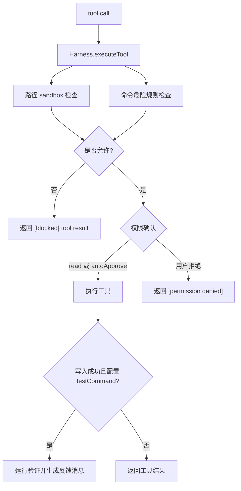

# Permission / Sandbox / Safety

## 学习目标

这篇笔记分析 Claude Code 和当前 `coding-agent` 在权限与安全上的设计差异，重点回答三个问题：

- 为什么权限判断应该集中在工具执行边界，而不是只写在提示词里？
- 命令、文件路径和用户确认分别解决哪些不同风险？
- 当前 `coding-agent` 的安全能力边界在哪里，哪些不能被描述成完整沙箱？

## 架构示意



## Claude Code 设计

Claude Code 的权限系统围绕工具使用前的判断展开。工具请求会进入权限检查逻辑，结合权限模式、工具类别、路径、命令、用户配置、项目 trust、危险模式、UI 确认和历史拒绝信息给出允许、拒绝或需要确认的结果。

它的安全设计是分层的：文件系统有路径校验和访问策略，shell 命令有分类器、危险模式和只读判定，权限模式控制自动化程度，UI 负责把风险解释给用户，sandbox 相关能力则尽量限制命令执行的影响面。这些层次共同降低风险，但仍需要持续治理和测试。

## 关键场景

- 文件读取：允许读取项目内文本文件，但拒绝越界路径和二进制内容。
- 文件写入：写入前需要确认或策略允许，并且必须说明覆盖写入风险。
- 命令执行：普通测试命令可以执行，递归删除、系统目录写入、提权命令应被拒绝或强确认。
- 自动批准：自动模式可以跳过人工确认，但不能绕过路径边界、命令规则或输入校验。

## 数据流 / 控制流

Claude Code 的抽象链路：

```text
模型请求工具
-> 构造权限上下文
-> 工具级输入校验
-> 路径 / 命令 / 策略分类
-> 权限模式判断
-> 必要时 UI 确认
-> 允许执行或返回拒绝结果
-> 记录权限与安全事件
```

当前 `coding-agent` 的抽象链路：

```text
Agent Loop 收到 tool_calls
-> Harness.executeTool()
-> 路径边界和工具类别判断
-> 权限确认或 autoApprove
-> 基础危险命令规则
-> ToolRegistry.execute()
-> 编辑成功后可触发测试验证
-> 结果回传模型并记录事件
```

## 当前 coding-agent 实现对比

### 当前已实现

- Harness 集中编排权限确认、安全规则、工具执行和编辑后验证。
- `read_file` / `write_file` / `edit_file` 只接受非空相对路径，拒绝绝对路径和包含 `..` 的路径片段。
- `grep` / `glob` 的可选 `path` 同样受相对路径边界约束。
- `read_file` 拒绝二进制文件。
- `run_command` 有工作目录、超时和基础危险命令规则。
- `--auto-approve` 只跳过人工确认，不能绕过路径边界、命令规则、参数校验或工具错误回传。
- 权限、安全、命令执行相关改动需要补拒绝路径、失败命令或拦截规则测试。

### 当前规划中

- P8 计划增强命令权限策略，例如更细的危险命令分类和拦截。
- P12 计划配置策略治理，例如 workspace trust、工具开关和规则配置。
- P7 / P9 涉及 diff、验证闭环和工具编排，可进一步降低错误写入风险。

### 不适合当前阶段

- 当前没有完整 OS 级沙箱，不能把 `run_command` 描述成任意命令安全执行。
- 当前危险命令规则是基础规则，不是成熟完整的命令安全策略。
- 当前没有企业级权限治理、远程策略同步或完整 trust 平台。

## 可以借鉴的设计

- 权限逻辑应继续集中在 Harness 或未来策略层，避免散落到各工具和 Agent Loop。
- 每条拒绝规则都应有测试证明会拒绝危险输入，并证明正常输入不被误伤。
- 自动批准、trust 和策略配置如果扩展，必须保持“跳过确认不等于跳过校验”。
- 安全事件需要脱敏摘要，不能记录密钥、完整环境变量或真实凭证。

## 不应该照搬的设计

- 不应只靠系统提示词要求模型“不要做危险操作”。
- 不应把 Claude Code 的复杂权限模式一次性搬入学习版 agent。
- 不应在没有底层隔离能力时宣称完整 sandbox。

## 参考文件

Claude Code：

- `<claude-code-snapshot>/src/hooks/useCanUseTool.js`
- `<claude-code-snapshot>/src/types/permissions.js`
- `<claude-code-snapshot>/src/utils/permissions/`
- `<claude-code-snapshot>/src/utils/sandbox/`

coding-agent：

- `src/harness.ts`
- `src/permissions/index.ts`
- `src/permissions/rules.ts`
- `src/permissions/sandbox.ts`
- `tests/harness.test.ts`
- `tests/permissions/*.test.ts`
