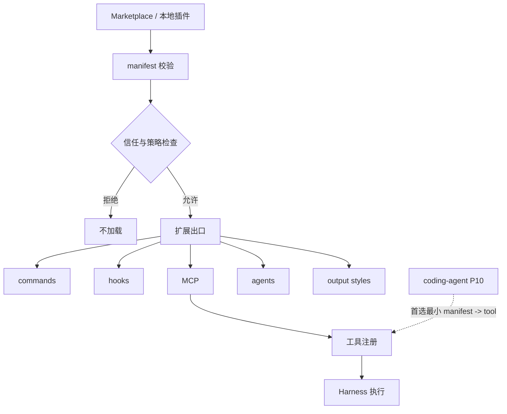

# 插件系统与扩展治理

## 学习目标

这篇笔记分析 Claude Code 的插件系统和当前 `coding-agent` 的扩展治理边界，重点回答三个问题：

- 插件和 Skill、MCP、工具注册之间是什么关系？
- 插件市场、安装、信任和更新为什么属于治理问题，而不只是加载代码？
- 当前 `coding-agent` 可以借鉴哪些边界，而不承诺完整插件市场？

## 架构示意



## Claude Code 设计

Claude Code 的插件系统覆盖插件发现、安装、校验、市场、信任提示、命令扩展、hook 扩展、MCP 集成、LSP 推荐、输出风格和插件配置。插件不是单一能力，而是一组可能影响运行时行为、用户界面和外部连接的扩展包。

插件治理的重点在于信任和生命周期：插件从哪里来、是否通过校验、是否被用户信任、能注册哪些能力、更新和禁用如何处理、失败时是否影响主会话。这些问题如果没有明确边界，插件会很容易变成绕过安全模型的后门。

## 关键场景

- 插件安装：从 marketplace 或本地目录安装插件，需要解析 metadata、依赖和兼容性。
- 插件命令：插件可扩展 CLI 命令或 UI 流程，但不能破坏核心会话边界。
- 插件工具：插件可能注册 MCP 工具、Skill 或本地工具，需要统一权限治理。
- 信任提示：插件代码或脚本可能执行本地操作，必须让用户理解来源和风险。

## 数据流 / 控制流

Claude Code 的抽象链路：

```text
发现 marketplace / 本地插件
-> 校验 plugin manifest 和版本
-> 信任确认和策略检查
-> 加载 commands / hooks / MCP / skills / output styles
-> 注册到对应运行时
-> 会话中按权限边界调用
-> 更新、禁用、错误隔离和 telemetry
```

当前 `coding-agent` 的可规划链路：

```text
P10 定义扩展工具 manifest
-> 校验 manifest
-> 生成运行时 ToolDefinition
-> Harness 执行并记录事件
-> P12 通过配置策略控制启用范围
```

## 当前 coding-agent 实现对比

### 当前已实现

- 当前没有插件系统或插件市场。
- 当前工具注册是静态默认注册表。
- hooks 已有基础运行时，但主要服务 observability，不是插件市场能力。

### 当前规划中

- `docs/plan/p10-mcp-plugin-tools.md` 计划探索 MCP / 插件式工具扩展。
- `docs/plan/p12-config-policy-governance.md` 计划配置策略治理，可承载启用/禁用和 trust 类边界。
- 如果未来实现插件式工具，必须继续通过 Harness 执行，不允许插件绕过权限、安全和验证。

### 不适合当前阶段

- 不适合声称当前已有插件市场、插件加载、插件命令或插件自动更新。
- 不适合把外部代码执行能力作为默认学习版特性。
- 不适合把插件、Skill、MCP 和工具混成没有治理边界的“扩展”。

## 可以借鉴的设计

- 插件能力应拆成不同出口：工具、hook、命令、上下文片段或 UI 扩展。
- 每种出口都应有独立权限和失败隔离策略。
- manifest 校验和信任提示应先于执行能力。
- 插件扩展工具仍应转成模型可见 schema 和运行时 `ToolDefinition`，并经 Harness 执行。

## 不应该照搬的设计

- 不应在 P10 首版实现 marketplace、依赖解析、自动更新和插件统计。
- 不应让插件修改核心系统提示词或工具注册表而没有审计记录。
- 不应让插件 hook 改变 Agent 成败，除非同步设计阻断语义和恢复测试。

## 参考文件

Claude Code：

- `<claude-code-snapshot>/src/plugins/`
- `<claude-code-snapshot>/src/services/plugins/`
- `<claude-code-snapshot>/src/commands/plugin/`
- `<claude-code-snapshot>/src/utils/plugins/`

coding-agent：

- `src/tools/index.ts`
- `src/observability/hooks.ts`
- `src/harness.ts`
- `docs/plan/p10-mcp-plugin-tools.md`
- `docs/plan/p12-config-policy-governance.md`
