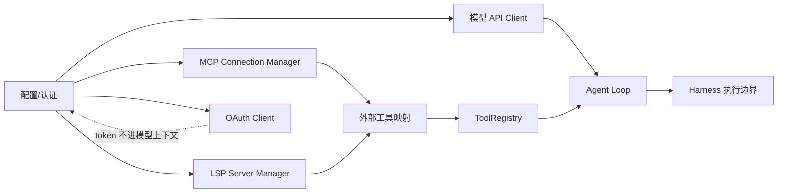

# MCP / LSP / API 服务层

## 学习目标

这篇笔记分析 Claude Code 和当前 `coding-agent` 在外部服务集成上的差异，重点回答三个问题：

- MCP、LSP、模型 API 和 OAuth 为什么应被视为服务层，而不是散落在工具里的调用？
- 外部连接管理需要处理哪些认证、重试和生命周期问题？
- 当前 `coding-agent` 应该怎样保持 OpenAI-compatible API 边界，避免提前承诺完整服务生态？

## 架构示意



## Claude Code 设计

Claude Code 的服务层覆盖模型 API、MCP、LSP、OAuth、插件服务和远程连接等能力。它们共同特点是：不是一次性函数调用，而是有连接状态、认证信息、重试策略、协议版本、错误恢复、配置来源和生命周期管理。

MCP 将外部工具服务器映射成模型可用工具；LSP 提供代码语义能力；OAuth 和 API 服务负责认证和配额；模型 API 层处理请求、流式响应、fallback、token budget 和错误分类。这些服务最终会影响 Agent Loop 的可用工具、上下文内容和停止/恢复逻辑。

## 关键场景

- MCP 工具加载：会话启动后连接 MCP server，读取工具列表并转成模型 schema。
- LSP 语义能力：代码跳转、诊断或符号信息可作为工具或上下文提供。
- API 认证：OAuth token、API key 和刷新逻辑必须和普通上下文脱离，不能进入 trace 明文。
- 请求重试：模型 API、MCP server 或语言服务失败时，需要区分可恢复错误和终止错误。

## 数据流 / 控制流

Claude Code 的抽象链路：

```text
读取配置和认证
-> 初始化服务客户端
-> 建立 MCP / LSP / API 连接
-> 发现能力并映射成工具或上下文
-> Agent Loop 调用服务-backed 工具
-> 处理重试、超时、认证刷新和错误分类
-> 记录脱敏事件
```

当前 `coding-agent` 的抽象链路：

```text
读取 ARK_API_KEY / ARK_MODEL / BASE_URL 等配置
-> LLMClient 调用 OpenAI-compatible chat/completions
-> ToolRegistry 只包含本地默认工具
-> Harness 执行本地工具
-> observability 记录脱敏摘要
```

## 当前 coding-agent 实现对比

### 当前已实现

- `src/llm-client.ts` 负责 OpenAI-compatible `chat/completions` 请求。
- `src/config.ts` 要求 `ARK_API_KEY` 和 `ARK_MODEL` 必填，禁止静默默认模型。
- 当前工具都是本地运行时工具，不包含 MCP 或 LSP 来源。
- observability event 会做摘要和敏感信息脱敏。

### 当前规划中

- P10 计划探索 MCP / 插件式工具扩展，首版应以 manifest 到 `ToolDefinition` 的映射为边界。
- P12 计划配置治理，可能承载非敏感项目配置和工具开关。
- 未来如果引入服务层，需要覆盖配置优先级、环境变量读取、非法值、默认值和测试。

### 不适合当前阶段

- 当前没有 MCP 客户端、LSP 客户端、OAuth 流程或多模型适配层。
- 当前不应描述成已经支持完整外部协议生态。
- 不应在工具实现里直接读取环境变量或自行管理认证。

## 可以借鉴的设计

- 外部服务应有独立客户端和配置层，不应散落在具体工具里。
- 服务产生的工具仍要导出模型 schema，并通过 Harness 统一执行。
- 认证材料必须留在配置/secret 层，trace 和 hook payload 只能记录脱敏摘要。
- 错误分类应逐步结构化，例如认证失败、超时、协议错误和服务不可用。

## 不应该照搬的设计

- 不应在没有实际需求时引入完整 MCP/LSP/OAuth 生命周期。
- 不应让服务层改变现有 tool call -> Harness -> ToolRegistry -> tool message 的主边界。
- 不应把 Claude Code 的服务成熟度写成本项目当前能力。

## 参考文件

Claude Code：

- `<claude-code-snapshot>/src/services/mcp/`
- `<claude-code-snapshot>/src/services/lsp/`
- `<claude-code-snapshot>/src/services/api/`
- `<claude-code-snapshot>/src/services/oauth/`

coding-agent：

- `src/llm-client.ts`
- `src/config.ts`
- `src/tools/index.ts`
- `src/observability/events.ts`
- `docs/plan/p10-mcp-plugin-tools.md`
