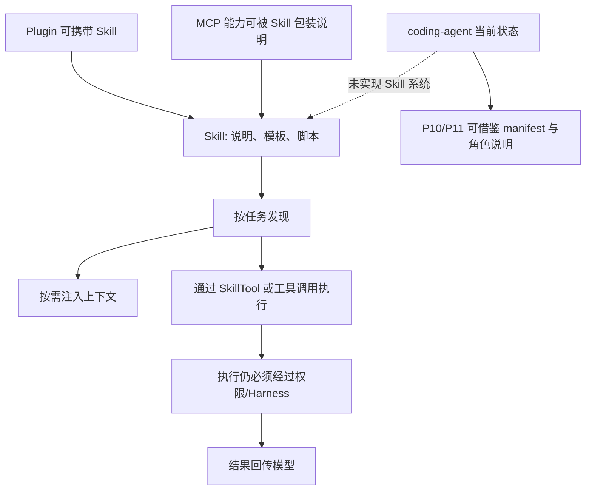

# Skill 系统与能力扩展

## 学习目标

这篇笔记分析 Claude Code 的 Skill 系统和当前 `coding-agent` 的能力扩展边界，重点回答三个问题：

- Skill 为什么不是普通提示词片段，而是一种工具化能力扩展机制？
- Skill、Tool、MCP 和 Plugin 之间应如何划分边界？
- 当前 `coding-agent` 是否应该实现 Skill 系统，或者只保留规划接口？

## 架构示意



## Claude Code 设计

Claude Code 的 Skill 系统用于把特定领域能力组织成可发现、可加载、可执行的扩展。Skill 通常包含说明文档、触发条件、脚本、模板、资源和执行约束。模型可以通过 SkillTool 或上下文发现机制使用这些能力，运行时则负责加载技能目录、处理权限、调用脚本、注入说明和记录使用情况。

它解决的问题不是“多给模型一段提示词”，而是把可复用能力从主系统提示词中拆出来，让工具、模板、脚本和项目上下文按需进入任务。这样可以降低基础提示词负担，也能让特定工作流拥有更稳定的执行路径。

## 关键场景

- 文档生成 Skill：提供固定模板和脚本，让模型按组织格式生成内容。
- MCP Skill builder：把外部 MCP 能力包装成模型可理解的 Skill 使用方式。
- 项目级 Skill：某个仓库内的约定可以作为 Skill 被发现并参与上下文。
- 权限交互：Skill 内脚本可能读写文件或执行命令，仍需要经过权限和安全边界。

## 数据流 / 控制流

Claude Code 的抽象链路：

```text
扫描 bundled / user / project skill 目录
-> 解析 skill metadata 和说明
-> 根据任务或命令发现可用 skill
-> 将必要说明注入上下文或通过 SkillTool 调用
-> 运行脚本 / 读取模板 / 产出结果
-> 经过权限、安全和 trace 记录
```

当前 `coding-agent` 的可规划链路：

```text
P10 定义外部工具 manifest
-> 转换为运行时 ToolDefinition
-> 通过 Harness 执行
-> P11 如需子 Agent，可把能力范围作为角色配置
-> 结果以工具消息或摘要回传
```

## 当前 coding-agent 实现对比

### 当前已实现

- 当前没有 Skill 系统。
- 当前默认能力通过固定工具注册表提供。
- 能力扩展的执行边界仍是 ToolDefinition -> Harness -> ToolRegistry。

### 当前规划中

- `docs/plan/p10-mcp-plugin-tools.md` 计划探索 MCP / 插件式工具扩展。
- `docs/plan/p11-multi-agent-orchestration.md` 计划探索子 Agent 角色和工具范围。
- 这些计划可以借鉴 Skill 的“按需加载能力说明”和“扩展能力必须经过统一执行边界”。

### 不适合当前阶段

- 不适合声称当前项目已有 Skill 加载、SkillTool、动态发现或 MCP skill builder。
- 不适合先实现完整 Skill 目录生态，再反推主工具协议。
- 不适合让 Skill 脚本绕过 Harness 执行命令或写文件。

## 可以借鉴的设计

- 能力扩展应有 manifest 或 metadata，明确名称、描述、输入、权限类别和执行方式。
- Skill 文档可作为按需上下文，避免所有能力说明常驻系统提示词。
- 如果未来引入脚本型扩展，执行仍必须复用 Harness 的权限、安全和验证边界。
- Skill、MCP 和 Plugin 的共同抽象可以先收敛到“产生工具定义或上下文片段”。

## 不应该照搬的设计

- 不应把 Claude Code 的 Skill 搜索、内置技能、MCP builder 和使用统计一次性实现。
- 不应把 Skill 当作绕过工具 schema 的自由文本执行入口。
- 不应把 Skill 系统写入当前已实现能力描述。

## 参考文件

Claude Code：

- `<claude-code-snapshot>/src/tools/SkillTool/`
- `<claude-code-snapshot>/src/skills/`
- `<claude-code-snapshot>/src/services/skillSearch/`
- `<claude-code-snapshot>/src/utils/hooks/registerSkillHooks.ts`

coding-agent：

- `src/tools/index.ts`
- `src/tools/types.ts`
- `src/harness.ts`
- `docs/plan/p10-mcp-plugin-tools.md`
- `docs/plan/p11-multi-agent-orchestration.md`
