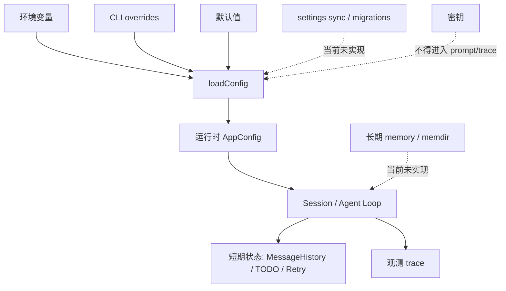

# 状态、记忆与配置治理

## 学习目标

这篇笔记分析 Claude Code 和当前 `coding-agent` 在状态、记忆和配置治理上的差异，重点回答三个问题：

- AppState、SessionMemory、settings 和 migrations 分别解决什么问题？
- 配置为什么需要 schema、优先级、迁移和敏感信息边界？
- 当前 `coding-agent` 已实现哪些配置能力，哪些记忆治理仍只是规划方向？

## 架构示意



## Claude Code 设计

Claude Code 需要管理多层状态：当前会话状态、用户设置、项目设置、权限规则、插件配置、会话记忆、长期 memory、同步设置、迁移版本和运行时缓存。不同状态的生命周期不同，有的只存在于一次查询，有的跨会话保存，有的需要组织级策略覆盖。

配置治理的核心是可解释和可迁移：设置从哪里来、谁覆盖谁、非法值如何报错、默认值是什么、旧版本如何迁移、敏感数据如何存储。长期记忆还需要解决来源、提取、更新、删除和上下文注入的边界。

## 关键场景

- 环境配置：模型、API key、base URL、max turns 等需要明确校验和错误提示。
- 会话状态：用户连续多轮对话，需要保留消息历史和规划状态。
- 长期记忆：成熟产品会把用户偏好或项目知识保存到 memdir，但必须避免污染事实上下文。
- 设置迁移：插件、权限和模型配置升级时，需要兼容旧 schema。

## 数据流 / 控制流

Claude Code 的抽象链路：

```text
读取默认设置、用户设置、项目设置和托管策略
-> schema 校验和迁移
-> 加载 session state / memory / plugin config
-> Agent Loop 运行时读写短期状态
-> 必要时提取或更新长期记忆
-> 保存状态并同步设置
```

当前 `coding-agent` 的抽象链路：

```text
parseConfig 读取环境变量和 CLI overrides
-> 校验 ARK_API_KEY / ARK_MODEL / MAX_TURNS 等字段
-> runSession 创建本地会话
-> MessageHistory 管理消息
-> TodoStore 管理规划状态
-> observability 写入本地 trace
```

## 当前 coding-agent 实现对比

### 当前已实现

- `ARK_API_KEY` 和 `ARK_MODEL` 必填，禁止静默默认模型。
- `MAX_TURNS` 做正整数校验。
- 新增配置字段需要覆盖 override 优先级、环境变量读取、非法值和默认值。
- `src/session.ts`、`src/context/*` 和 `src/planning/todo.ts` 提供短期会话与规划状态。
- observability trace 写入本地目录，并做敏感信息脱敏。

### 当前规划中

- P6 计划会话持久化。
- P12 计划 `.coding-agent/config.json`、workspace trust、策略校验和配置治理。
- 未来如果引入长期 memory，需要明确它只是上下文来源之一，不能替代工具结果。

### 不适合当前阶段

- 当前没有成熟 memdir、SessionMemory、settings sync、schema migrations 或组织级策略平台。
- 当前没有真正检索增强 RAG。
- 不应把本地 trace 或 TODO 状态描述成长期记忆系统。

## 可以借鉴的设计

- 配置来源优先级必须稳定且可测试。
- 配置和记忆都应区分敏感与非敏感数据，密钥不能进入文档、trace 或 hook payload。
- 长期状态引入前应先定义 schema 和迁移策略，避免后续破坏用户数据。
- 会话持久化应保持 tool call / tool message 配对，不能只保存展示文本。

## 不应该照搬的设计

- 不应在没有用户需求时实现复杂 settings sync。
- 不应让长期 memory 自动改写系统提示词或工具结果。
- 不应把配置治理和插件治理混在一起，导致权限边界不可审计。

## 参考文件

Claude Code：

- `<claude-code-snapshot>/src/state/`
- `<claude-code-snapshot>/src/memdir/`
- `<claude-code-snapshot>/src/services/SessionMemory/`
- `<claude-code-snapshot>/src/services/settingsSync/`
- `<claude-code-snapshot>/src/schemas/`
- `<claude-code-snapshot>/src/migrations/`

coding-agent：

- `src/config.ts`
- `src/session.ts`
- `src/context/message-history.ts`
- `src/planning/todo.ts`
- `docs/plan/p6-session-persistence.md`
- `docs/plan/p12-config-policy-governance.md`
