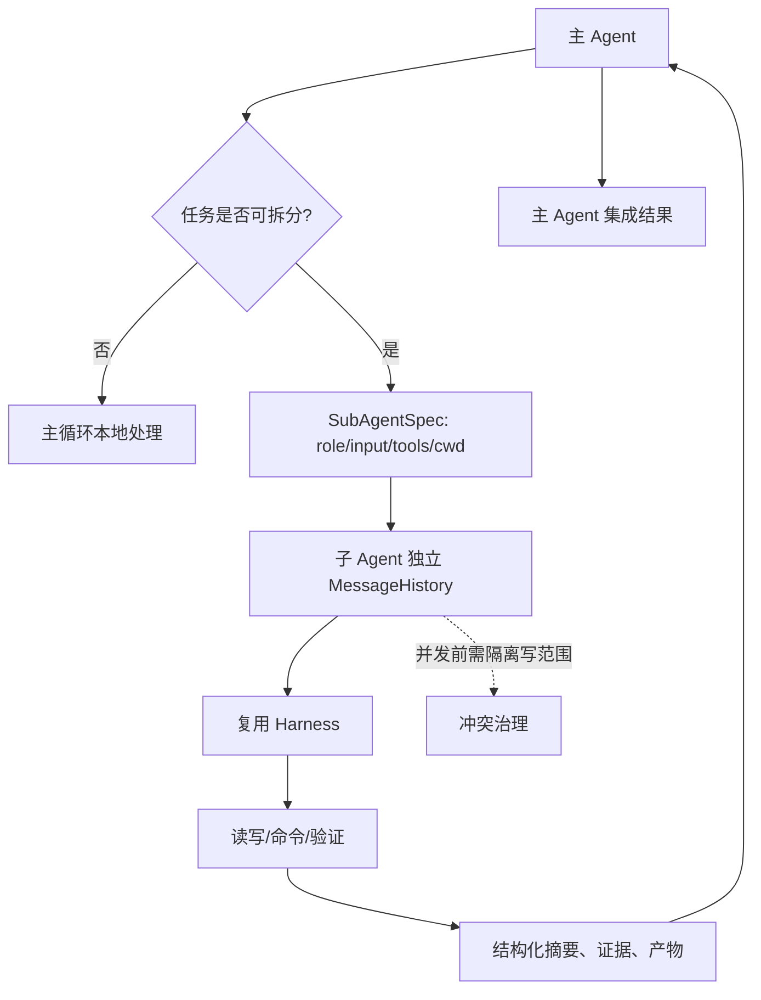

# Sub-agent / Task / Coordinator

## 学习目标

这篇笔记分析 Claude Code 和当前 `coding-agent` 在子 Agent、任务和协调器上的差异，重点回答三个问题：

- 子 Agent 解决的是哪些单 Agent 难以处理的问题？
- 并发任务如何隔离上下文、工具权限和工作区写入冲突？
- 当前 `coding-agent` 的 P11 计划应该借鉴哪些边界，哪些复杂协作能力不适合提前承诺？

## 架构示意



## Claude Code 设计

Claude Code 的子任务能力可以把复杂任务拆给 AgentTool、Task 系统或协调器执行。子 Agent 通常拥有独立消息历史、角色说明、工具范围、任务输入和结果摘要。主 Agent 不需要继承子 Agent 的全部中间历史，而是接收压缩后的结果、证据和必要文件变化。

成熟的多 Agent 设计还要处理并发隔离、权限桥接、工作区冲突、结果合并、失败恢复、进度展示和资源控制。否则“并行”很容易变成重复探索、互相覆盖文件或不可复盘的状态污染。

## 关键场景

- 探索任务：一个子 Agent 查找相关文件，主 Agent 同时阅读核心实现。
- 实现拆分：多个子 Agent 修改互不重叠的模块，最后由主 Agent 集成。
- 长任务压缩：子 Agent 完成大量读写后，只把摘要和证据回传主 Agent。
- 权限同步：子 Agent 请求写文件或执行命令时，仍需要遵守主工作区安全边界。

## 数据流 / 控制流

Claude Code 的抽象链路：

```text
主 Agent 识别可拆分任务
-> 创建 Task / AgentTool 调用
-> 子 Agent 获得角色、输入、工具范围和独立历史
-> 子 Agent 执行工具并记录事件
-> 返回摘要、产物、错误和证据
-> 主 Agent 集成结果并继续决策
```

当前 `coding-agent` 的规划链路：

```text
P11 定义 sub-agent 协议
-> 每个子 Agent 独立 MessageHistory
-> 复用 Agent Loop 和 Harness
-> 限定工具范围和工作目录
-> 返回结构化摘要
-> 主 Agent 负责集成和冲突处理
```

## 当前 coding-agent 实现对比

### 当前已实现

- 当前没有内置 sub-agent、Task coordinator 或多 Agent 并行编排。
- 当前已有 Agent Loop、Harness、MessageHistory、observability 和工具权限边界，可作为未来子 Agent 的基础构件。
- 当前单 Agent 执行路径仍是最清晰、最可测的主路径。

### 当前规划中

- `docs/plan/p11-multi-agent-orchestration.md` 计划新增 sub-agent 协议，包含角色、输入、工具范围、工作目录、结果摘要和观测 runId。
- P11 要求子 Agent 复用现有 Agent Loop 和 Harness，并拥有独立消息历史。
- 未来需要处理并发写冲突、摘要质量和主 Agent 集成责任。

### 不适合当前阶段

- 当前不应声称已经支持子 Agent、swarm、远程多 Agent 或成熟协调器。
- 不适合在没有冲突隔离和结果协议前开放并发写入。
- 不适合让子 Agent 绕过主项目的权限、安全和验证要求。

## 可以借鉴的设计

- 子 Agent 必须有独立历史，避免污染主 Agent 上下文。
- 主 Agent 应接收摘要、证据和产物引用，而不是完整中间对话。
- 并发实现前要定义 disjoint write set 或工作区隔离策略。
- observability runId 应支持关联主任务和子任务，方便复盘。

## 不应该照搬的设计

- 不应为了并行而拆分紧耦合、阻塞当前下一步的任务。
- 不应把子 Agent 结果当作无需验证的事实。
- 不应把多 Agent 协作描述成当前已实现能力。

## 参考文件

Claude Code：

- `<claude-code-snapshot>/src/tools/AgentTool/`
- `<claude-code-snapshot>/src/tasks.ts`
- `<claude-code-snapshot>/src/Task.ts`
- `<claude-code-snapshot>/src/coordinator/`
- `<claude-code-snapshot>/src/utils/swarm/`

coding-agent：

- `src/agent-loop.ts`
- `src/harness.ts`
- `src/context/message-history.ts`
- `src/observability/events.ts`
- `docs/plan/p11-multi-agent-orchestration.md`
