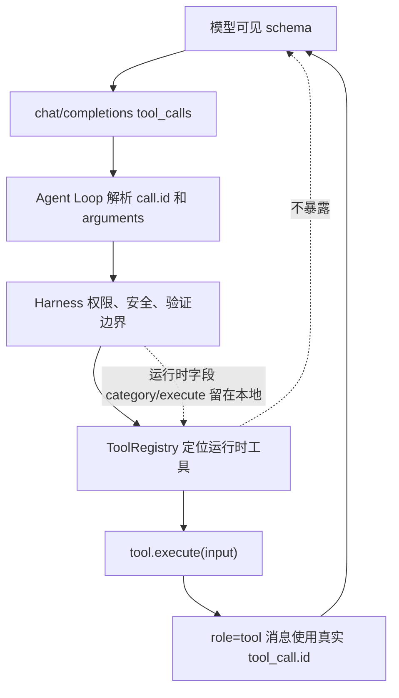

# Tool Use 协议与执行链路

## 学习目标

这篇笔记分析 Claude Code 和当前 `coding-agent` 在工具协议上的设计差异，重点回答三个问题：

- 模型可见的工具 schema 和运行时工具对象为什么必须分离？
- tool use 从模型响应到执行结果回传需要经过哪些边界？
- 当前 `coding-agent` 应该保留哪些协议正确性，哪些产品级工具治理不适合提前引入？

## 架构示意



## Claude Code 设计

Claude Code 的工具系统不是一组普通函数，而是一套围绕模型协议、权限、UI、结果渲染和运行时上下文组织起来的执行框架。工具定义通常同时包含模型可见信息、输入校验、权限判断、执行函数、结果格式化、并发和 UI 展示能力。

这套设计的关键点是：模型只能看到可调用工具的名称、描述和输入 schema；运行时侧则保留权限上下文、Agent 身份、工作目录、会话状态、MCP/Skill/Plugin 来源和 UI 回调。工具执行结果也不是简单 stdout，而是会被转换成模型可消费的 tool result，同时给 UI、trace、hooks 和会话历史提供不同视图。

## 关键场景

- 普通文件工具：模型看到 `Read` / `Edit` 这类工具的参数约束，运行时再做路径、权限、编码和展示处理。
- Bash / Shell 工具：模型发起命令，运行时先做权限、危险命令、sandbox、输出截断和交互确认，再把结构化结果回传。
- 动态工具：MCP、Skill、插件会让可用工具集合随会话、项目或配置变化，需要在每轮请求前刷新模型 schema。
- 工具失败：执行异常、权限拒绝或输入错误需要转成 tool result，而不是破坏 assistant tool use 和 tool message 配对。

## 数据流 / 控制流

Claude Code 的抽象链路：

```text
工具来源加载
-> 过滤当前会话可用工具
-> 导出模型可见 schema
-> 模型返回 tool_use
-> 运行时按名称定位工具
-> 输入校验和权限判断
-> 执行工具并收集结果
-> 格式化为 tool_result
-> 写入消息历史、UI、trace、hooks
```

当前 `coding-agent` 的抽象链路：

```text
默认 ToolRegistry 注册工具
-> getToolDefinitions() 导出 OpenAI-compatible function schema
-> 模型返回 tool_calls
-> Agent Loop 调用 HarnessLike.executeTool()
-> Harness 编排权限、安全、执行和验证
-> ToolRegistry 定位运行时 ToolDefinition.execute()
-> 使用真实 tool_call.id 追加 role=tool 消息
```

## 当前 coding-agent 实现对比

### 当前已实现

- `src/types.ts` 只表达 LLM API 消息协议和 OpenAI-compatible 工具 schema。
- `src/tools/types.ts` 表达运行时工具协议，包含 `execute(input)` 和可选 `category`。
- `ToolRegistry.getToolDefinitions()` 只导出 `{ type: "function", function: { name, description, parameters } }`，不泄露 `execute` 或 `category`。
- Agent Loop 只通过 `HarnessLike.executeTool()` 执行工具，不绕过 Harness 直接调用 registry。
- 工具结果回传时使用模型返回的真实 `tool_call.id`。
- 工具参数解析失败会显式报错，不能静默改写成 `{}`。
- 默认工具包括 `read_file`、`write_file`、`edit_file`、`run_command`、`grep`、`glob`、`todo_write`。

### 当前规划中

- P9 计划进一步强化工具编排，例如 artifact、验证摘要和工具结果组织。
- P10 计划探索 MCP / 插件式工具扩展，但不是完整插件市场。
- P12 计划把配置策略和工具开关纳入治理。

### 不适合当前阶段

- 不适合把工具定义扩展成 Claude Code 那种同时承担 UI、权限、动态来源和产品策略的大型对象。
- 不适合让模型看到运行时字段、权限策略或内部执行函数。
- 不适合在没有 MCP/插件基础设施时实现动态市场级工具加载。

## 可以借鉴的设计

- 工具协议应持续保持“模型 schema”和“运行时执行对象”分离。
- 动态工具扩展如果进入 P10，应先复用现有 `ToolDefinition` 边界，再增加来源、权限和配置元数据。
- 工具失败、权限拒绝和验证失败都应尽量变成模型可消费的结果，保留多轮修复机会。
- 工具结果可逐步拆成模型摘要、用户展示和 trace payload 三种视图，但脱敏规则必须统一。

## 不应该照搬的设计

- 不应把 Claude Code 的所有工具来源、UI 渲染和远程协议塞进当前 registry。
- 不应让工具自己绕过 Harness 做权限确认或测试验证。
- 不应为了支持未来插件，把当前默认工具协议改得难以审计。

## 参考文件

Claude Code：

- `<claude-code-snapshot>/src/Tool.ts`
- `<claude-code-snapshot>/src/tools.ts`
- `<claude-code-snapshot>/src/services/tools/`
- `<claude-code-snapshot>/src/tools/`

coding-agent：

- `src/types.ts`
- `src/tools/types.ts`
- `src/tools/index.ts`
- `src/harness.ts`
- `src/agent-loop.ts`
- `tests/tools/registry-integration.test.ts`
