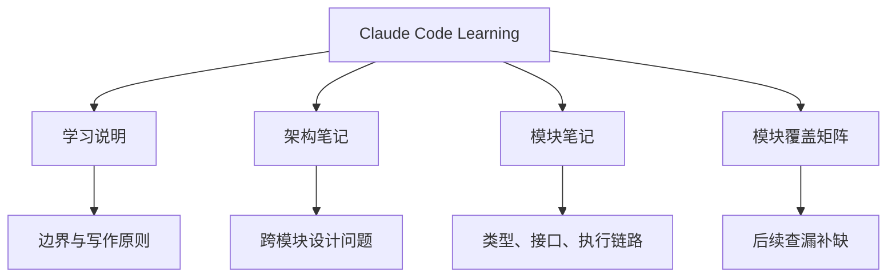

# Claude Code Learning

这个站点用于系统学习 Claude Code 的架构设计，并把观察到的设计取舍和当前 `coding-agent` 实现做对比。目标不是复刻 Claude Code，而是沉淀可复用的 agent 工程设计判断。

## 阅读入口

## 核心页面

- [学习说明](/README)：阅读顺序、归档原则和写作边界。
- [架构笔记](/architecture/)：按跨模块设计问题梳理 Agentic Loop、工具协议、上下文、权限、扩展、远程桥接和可观测性。
- [模块笔记](/modules/)：按源码模块梳理 Query、Tool、Context、Harness、CLI/TUI、服务层和任务系统。
- [模块覆盖矩阵](/module-coverage)：对照 Claude Code 快照中的主要模块，检查学习主题覆盖情况。
- [分析模板](/templates/module-analysis)：新增模块笔记时使用的结构模板。

## 对比口径

- `当前已实现`：当前 `coding-agent` 源码和测试已经具备的能力。
- `当前规划中`：只在 `docs/plan/` 或其他计划文档中描述但尚未落地的能力。
- `Claude Code 设计`：参考项目中的架构形态，不等价于本项目已经拥有。

禁止把 Claude Code 的成熟能力描述成本项目已经实现的能力，尤其是完整沙箱、完整危险命令防护、插件市场、真正 RAG、远程会话、GitHub App 或 npm registry 发布运营。
