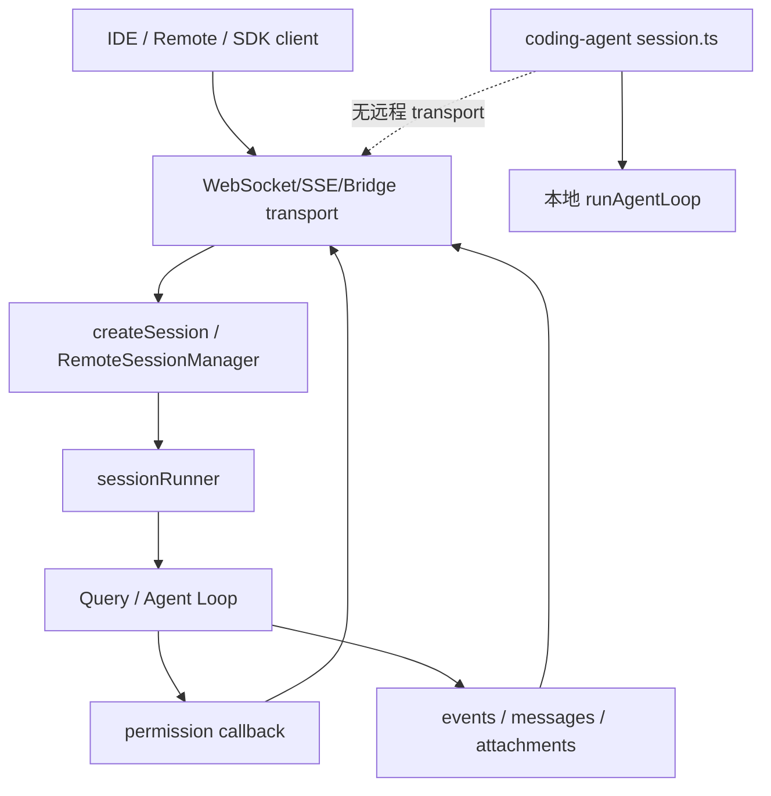

# Bridge / Remote / Server：多宿主会话、传输和权限回调

## 学习目标

这篇模块笔记关注 Claude Code 的 bridge、remote、server 和 SDK entrypoints。重点回答：

- 为什么一个 CLI Agent 会需要 bridge 和 server？
- 远程会话如何影响权限确认、附件、消息协议和 session 生命周期？
- 当前 `coding-agent` 的 `session.ts` 只是本地会话编排，不能被描述成远程 bridge。

## 模块图示



## 参考文件

Claude Code：

- `<claude-code-snapshot>/src/bridge/`
- `<claude-code-snapshot>/src/remote/`
- `<claude-code-snapshot>/src/server/`
- `<claude-code-snapshot>/src/cli/transports/`
- `<claude-code-snapshot>/src/entrypoints/sdk/`
- `<claude-code-snapshot>/src/commands/bridge/`
- `<claude-code-snapshot>/src/commands/remote-setup/`

coding-agent：

- `src/session.ts`
- `src/index.ts`
- `src/tui/app.tsx`
- `src/harness.ts`
- `src/observability/recorder.ts`
- `tests/index.test.ts`
- `tests/tui/app.test.tsx`

## Claude Code 模块职责

Bridge / Remote / Server 层把同一套 Agent 能力接到不同宿主：

- 本地 REPL。
- IDE bridge。
- Remote session。
- SDK。
- server direct connect。
- WebSocket / SSE / hybrid transport。

它需要处理：

- session 创建、恢复和 id 兼容。
- inbound messages 和 attachments。
- permission callback。
- remote auth / trusted device / work secret。
- 断线恢复和 flush gate。
- SDK schema 和事件适配。
- bridge UI 状态。

这类模块的核心不是模型能力，而是会话边界、传输可靠性和权限归属。

## Claude Code 典型链路

```text
远程或 IDE 客户端建立连接
-> bridge 创建/恢复 session
-> 客户端发送用户消息、附件、上下文
-> Query 运行并产生输出、工具请求、权限请求
-> bridge 把事件转发到客户端
-> 客户端返回权限决定或继续输入
-> session 状态同步、flush 和断线恢复
```

## coding-agent 当前本地 session

`src/session.ts` 的职责是本地会话编排：

- 空输入直接返回成功空结果。
- 创建 `EventRecorder`。
- 读取 hooks 配置。
- emit `SessionStart`、`UserPromptSubmit`。
- 调 `runAgentLoopWithOptions()` 或测试注入的 runner。
- emit `SessionEnd`。
- flush / close recorder。

`runAgentLoopWithOptions()` 创建：

- `Logger`
- `LLMClient`
- `Harness`
- `ContextCompressor`

然后调用 `runAgentLoop()`。

这仍是本地进程内会话，不包含远程传输、权限远程回调或 SDK schema。

## CLI / TUI 宿主边界

`src/index.ts`：

- 解析 CLI flags。
- 把 runtime flags 从 prompt 中剥离。
- 加载 config。
- 创建默认工具注册表。
- 有初始输入时执行单次 session。
- 无输入时进入 TUI。

`src/tui/app.tsx`：

- 在 Ink UI 中维护输入、消息列表、运行状态和权限提示。
- 提供 TUI 版 `permissionCheck`。
- 仍然调用 `runAgentSession()`。
- Harness 仍然是真实执行边界。

这说明当前已有多个本地宿主，但没有远程宿主。

## 与 Claude Code 的关键差异

Claude Code 的 bridge 层要跨进程、跨设备或跨 IDE；当前 `coding-agent` 只在同一 Node 进程内运行：

- 无 WebSocket/SSE transport。
- 无 remote auth。
- 无 SDK core/control schema。
- 无 IDE attachments。
- 无远程权限回调。
- 无 session restore 协议。

当前的事件 JSONL 是可观测材料，不是对外 SDK 事件协议。

## 风险与失败模式

如果未来实现 bridge，需要解决：

- 谁拥有工作目录和权限确认。
- 远程客户端传来的路径是否可信。
- secret 存在哪里，如何脱敏。
- 断线时工具是否继续执行。
- 权限请求超时如何处理。
- SDK 用户如何收到 tool result 和 final state。
- remote session 的 trace 如何和本地 trace 对齐。

## 测试证据

当前相关测试：

- `tests/index.test.ts`：CLI flag 剥离、初始输入、TUI 分支。
- `tests/tui/app.test.tsx`：TUI 输入、权限提示、消息展示。
- `tests/observability/recorder.test.ts`：事件 flush / close / hook dispatch。
- `tests/session` 目前不是独立目录，session 行为通过 CLI、observability 和 Agent Loop 测试间接覆盖。

## 可以借鉴的设计

- 未来如果做 SDK，应先定义稳定事件 schema，而不是复用人类输出。
- 权限回调可以抽象，但 Harness 仍要做最终校验。
- 附件和远程上下文必须和普通 prompt 分层。
- session id、runId、trace path 应建立清晰映射。

## 不应该照搬的设计

- 不应提前实现 server transport。
- 不应把本地 `session.ts` 描述成远程会话系统。
- 不应让 IDE/remote 前端直接执行工具。
- 不应在没有 auth 和 trust 设计前开放远程控制。
