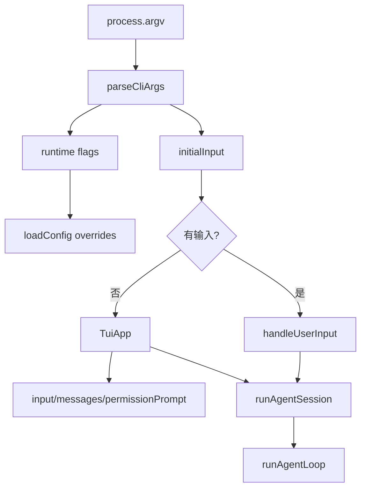

# CLI / Commands / TUI：入口解析、交互状态和权限 UI

## 学习目标

这篇模块笔记关注 Claude Code 的 CLI、commands、REPL 和 TUI 组件，以及当前 `coding-agent` 的本地 CLI/TUI。重点回答：

- CLI flag 为什么必须从用户 prompt 中剥离？
- TUI 权限确认如何接入 Harness，而不是绕过安全边界？
- 当前项目缺少哪些 slash command 和会话体验能力？

## 模块图示



## 参考文件

Claude Code：

- `<claude-code-snapshot>/src/main.tsx`
- `<claude-code-snapshot>/src/commands.ts`
- `<claude-code-snapshot>/src/commands/`
- `<claude-code-snapshot>/src/replLauncher.tsx`
- `<claude-code-snapshot>/src/components/`
- `<claude-code-snapshot>/src/screens/`
- `<claude-code-snapshot>/src/utils/processUserInput/`

coding-agent：

- `src/index.ts`
- `src/session.ts`
- `src/tui/app.tsx`
- `src/tui/index.tsx`
- `tests/index.test.ts`
- `tests/tui/app.test.tsx`
- `tests/tui/permission.test.tsx`
- `docs/plan/p13-tui-interaction.md`

## Claude Code 模块职责

Claude Code 的 CLI/TUI 层承担：

- 入口启动。
- 参数解析。
- REPL。
- slash command 路由。
- 用户输入分类：文本 prompt、bash mode、command、快捷操作。
- Ink UI 状态。
- 权限提示 UI。
- 配置、MCP、插件、session、cost、help 等命令。
- 会话恢复和诊断。

它不是简单把 argv 拼成 prompt，而是一个交互式应用框架。

## coding-agent CLI 技术细节

`parseCliArgs(argv)` 识别并剥离：

- `--auto-approve` / `-y`
- `--verbose` / `-v`
- `--test-command <value>`
- `--max-retries <positive integer>`
- `--hooks-config <value>`

剩余参数拼接为 `initialInput`。这条规则很重要：runtime flag 不能被传给模型当 prompt 内容。

`runCli(argv)`：

```text
parseCliArgs(argv)
-> loadConfig(overrides)
-> createDefaultToolRegistry(config.workingDirectory)
-> initialInput 非空：handleUserInput()
-> initialInput 为空：runTui()
```

`handleUserInput()`：

- 空输入直接继续。
- `.exit` 返回 false。
- 调 `runAgentSession()`。
- 输出 finalMessage、TODO、tools called 和 stopped 状态。
- 捕获错误并输出 `Error: ...`。

## coding-agent TUI 技术细节

`TuiApp` 使用 Ink 和 React state：

- `input`：当前输入行。
- `messages`：本地 transcript。
- `isRunning`：Agent 是否运行中。
- `permissionPrompt`：等待用户 y/n 的权限请求。
- `cursorOffsetRef`：光标位置。

TUI 的 `permissionCheck`：

- `autoApprove` 或 read 类工具直接批准。
- write/command 类工具创建 `PermissionPrompt`，等待用户按 `y` 或 `n`。
- 结果返回给 Harness。

这意味着 TUI 只提供确认 UI，真实执行仍由 `runAgentSession()` -> `runAgentLoop()` -> `Harness` 完成。

输入编辑支持：

- Enter 提交。
- `.exit` 退出。
- Ctrl+C / Ctrl+D 退出。
- 左右、Home、End、Backspace、Delete。
- Ctrl+A/E/B/F/U/K/W。

当前 TUI 没有 Vim 模式、命令面板、历史搜索或多行编辑。

## 数据流 / 控制流

```text
CLI argv
-> parseCliArgs()
-> loadConfig()
-> registry
-> initial prompt 或 TUI
-> runAgentSession()
-> runAgentLoop()
-> Harness permissionCheck
-> CLI stdout 或 TUI transcript
```

TUI 权限：

```text
Harness.checkToolPermission()
-> TUI permissionCheck()
-> setPermissionPrompt()
-> 用户按 y/n
-> resolve(PermissionDecision)
-> Harness 继续或拒绝
```

## 与 Claude Code 的关键差异

Claude Code 有完整命令生态和 REPL 产品体验；当前 `coding-agent` 有最小 CLI/TUI：

- 无 slash commands。
- 无 `/config`、`/compact`、`/permissions`、`/mcp`、`/plugin` 等命令。
- 无会话恢复命令。
- 无主题和 output style。
- 无完整诊断命令。

当前做对的是：flag 剥离、TUI 权限回调和执行边界分离。

## 测试证据

关键测试：

- `tests/index.test.ts`：flag 剥离、缺值报错、正整数校验、初始输入执行、TUI 分支、entrypoint 判断。
- `tests/tui/app.test.tsx`：输入提交、状态展示、结果展示、退出。
- `tests/tui/permission.test.tsx`：权限 prompt 的批准/拒绝路径。

## 可以借鉴的设计

- 未来 P13 可增加输入历史、多行输入和更清晰工具进度。
- 如果引入 slash commands，应明确 command 不进入模型 prompt。
- TUI 可以展示 trace/runId，方便复盘。
- 权限 UI 可展示更细风险，例如命令规则、写入路径和测试命令。

## 不应该照搬的设计

- 不应一次性实现 Claude Code 的全部 commands。
- 不应让 TUI 直接执行工具。
- 不应把本地 TUI 描述成 GUI 或完整 IDE Agent。
- 不应让 CLI flag 混入用户任务。
