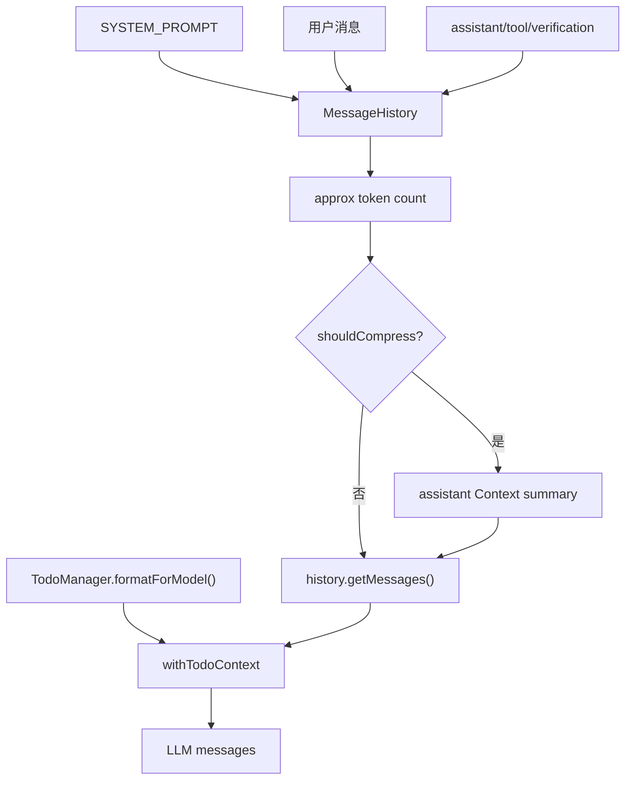

# Context：系统提示词、消息历史与压缩

## 学习目标

这篇模块笔记关注 Claude Code 的 context 层与当前 `coding-agent` 的 `src/context/*`。重点回答：

- 系统提示词、消息历史、TODO 状态和压缩摘要分别放在哪里？
- 历史压缩如何避免破坏 tool call / tool message 协议？
- 当前实现为什么只是“上下文压缩”，不是完整 memory 或 RAG？

## 模块图示



## 参考文件

Claude Code：

- `<claude-code-snapshot>/src/context.ts`
- `<claude-code-snapshot>/src/context/`
- `<claude-code-snapshot>/src/utils/messages.ts`
- `<claude-code-snapshot>/src/utils/attachments.ts`
- `<claude-code-snapshot>/src/services/compact/`
- `<claude-code-snapshot>/src/services/SessionMemory/`

coding-agent：

- `src/context/system-prompt.ts`
- `src/context/message-history.ts`
- `src/context/compressor.ts`
- `src/agent-loop.ts`
- `src/planning/todo.ts`
- `tests/context/system-prompt.test.ts`
- `tests/context/message-history.test.ts`
- `tests/context/compressor.test.ts`
- `tests/tools/todo-write.test.ts`

## Claude Code 模块职责

Claude Code 的 context 模块需要汇聚多种上下文来源：

- 系统提示词和产品级行为约束。
- 项目指令文件和用户上下文。
- 会话消息历史。
- 附件、图片、选择区、IDE 信息和 git 状态。
- compact 摘要和 token budget 信息。
- SessionMemory / memdir / skill discovery 等长期或半长期信息。
- 工具调用结果和中断恢复状态。

它的难点是：不同上下文来源有不同优先级、生命周期和协议约束。尤其是 tool use 与 tool result 成对关系不能被压缩破坏。

## coding-agent 模块职责

当前 `coding-agent` 的上下文实现由三个文件组成。

### system-prompt.ts

`SYSTEM_PROMPT` 是一个固定字符串，定义：

- 先用工具获取信息，不凭空猜文件内容。
- 多文件检索优先 `glob`，符号/错误文本用 `grep`，修改前用 `read_file`。
- 复杂任务用 `todo_write`。
- 工具失败后根据错误调整下一步。
- 不执行破坏性操作。
- 回答直接说明完成内容、剩余事项和风险。

它是高优先级系统上下文，但不是安全机制本身。真正拦截仍在 Harness、permissions 和工具校验。

### message-history.ts

`MessageHistory` 是一个轻量消息容器：

- `append(message)` 追加消息。
- `replace(messages)` 原地替换历史。
- `getMessages()` 返回拷贝，避免外部直接改内部数组。
- `getApproxTokenCount()` 用约 `4 chars = 1 token` 粗略估算。
- `getLastN(n)` 返回尾部消息。
- `clear()` 清空。

估算 token 时会统计：

- `role`
- `content`
- `tool_call_id`
- `tool_calls` 中的 id、type、function name、arguments

这保证 tool call 的 JSON 参数也计入压缩判断。

### compressor.ts

`ContextCompressor` 默认配置：

- `maxTokens = 100000`
- `compressionThreshold = 80000`
- `preserveLastN = 10`

核心流程：

```text
shouldCompress(history)
-> history.getApproxTokenCount() > compressionThreshold
-> compress(history)
-> 取第一条 system message
-> conversationalMessages = 其余消息
-> preservedTail = 最后 preserveLastN 条
-> messagesToCompress = 更早消息
-> client.chat(compressionSystemPrompt, compressionUserMessage)
-> 生成 assistant summary
-> system + summary + preservedTail
```

压缩提示要求保留：

- 读过或改过的文件。
- 关键决策。
- 当前任务状态。
- 失败或验证结果。
- 剩余下一步。
- 不编造完成工作或不存在能力。

## TODO 上下文注入

TODO 状态不直接写入 `MessageHistory`。Agent Loop 在每轮请求前调用：

```ts
withTodoContext(history.getMessages(), todoManager)
```

如果存在 TODO 状态，会在第一条 system message 后插入额外 system message。这样做的含义是：

- TODO 状态可以影响模型下一步计划。
- TODO 状态不替代真实消息历史。
- TODO 状态不替代工具结果。
- 历史压缩仍围绕真实消息进行。

## 数据流 / 控制流

```text
runAgentLoop 初始化 MessageHistory(system + user)
-> 每轮请求前 compressor.shouldCompress(history)
-> 需要压缩则 compressor.compress(history)
-> history.replace(compressedMessages)
-> withTodoContext(history.getMessages(), todoManager)
-> LLMClient.sendMessage(messages)
-> assistant/tool/verification message 写回 history
```

## 协议风险点

压缩最容易出错的地方是 tool call 配对：

- assistant message 如果带 `tool_calls`，后面必须有对应 `role: "tool"`。
- 如果压缩保留了 tool call，却删掉 tool message，下一次请求可能违反模型 API 协议。
- 当前策略保留最近 N 条消息，测试必须覆盖尾部配对完整。

另一个风险是摘要幻觉：压缩摘要由模型生成，必须在提示中强调“不编造完成工作”。但摘要仍不应成为比工具结果更高优先级的事实来源。

## 与 Claude Code 的关键差异

Claude Code context 层要处理项目指令、附件、IDE 上下文、memory、skill discovery、token budget continuation 和 compact retry。当前 `coding-agent` 只实现：

- 固定系统提示词。
- 消息历史容器。
- 简单 token 估算。
- 模型生成摘要式压缩。
- TODO 状态额外注入。

当前没有：

- 真正的检索增强 RAG。
- 长期 memory。
- 附件和图片上下文。
- IDE selection / diagnostics。
- 复杂 compact 状态机。

## 测试证据

关键测试包括：

- `tests/context/message-history.test.ts`：追加、替换、拷贝、token 估算和 lastN。
- `tests/context/compressor.test.ts`：压缩阈值、system 保留、尾部保留、摘要生成。
- `tests/context/system-prompt.test.ts`：系统提示词包含关键工具和安全原则。
- `tests/tools/todo-write.test.ts`：TODO 状态格式化。
- `tests/agent-loop.test.ts`：TODO context 注入不替代真实工具消息。

## 可以借鉴的设计

- 后续 P6 会话持久化应保存协议消息，而不只是保存文本 transcript。
- 压缩策略可以增加更严格的 tool call 配对保护。
- 如果引入 memory，应明确来源、可信度、更新时间和删除方式。
- 附件和项目上下文应有独立优先级，不应混进普通 assistant summary。

## 不应该照搬的设计

- 不应把当前上下文压缩描述成 RAG。
- 不应让 TODO、memory 或摘要覆盖真实工具结果。
- 不应在没有 schema 和迁移前实现长期记忆存储。
