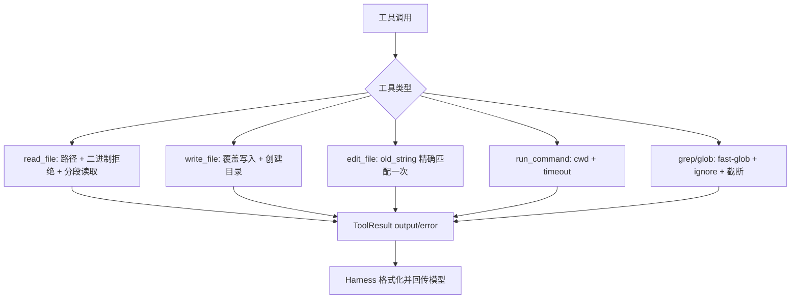

# 文件与命令工具：读写、精确编辑、搜索和命令执行

## 学习目标

这篇模块笔记关注 Claude Code 的文件/命令工具与当前 `coding-agent` 的默认本地工具实现。重点回答：

- 文件工具如何做路径、编码、二进制和大文件边界？
- `edit_file` 为什么要求 `old_string` 精确匹配一次？
- `run_command` 当前到底有什么安全能力，哪些没有？
- 搜索工具如何在简化实现里保持可用性和可控输出？

## 模块图示



## 参考文件

Claude Code：

- `<claude-code-snapshot>/src/tools/FileReadTool/`
- `<claude-code-snapshot>/src/tools/FileEditTool/`
- `<claude-code-snapshot>/src/tools/FileWriteTool/FileWriteTool.ts`
- `<claude-code-snapshot>/src/tools/BashTool/`
- `<claude-code-snapshot>/src/tools/GrepTool/`
- `<claude-code-snapshot>/src/tools/GlobTool/GlobTool.ts`
- `<claude-code-snapshot>/src/tools/PowerShellTool/PowerShellTool.tsx`

coding-agent：

- `src/tools/read-file.ts`
- `src/tools/write-file.ts`
- `src/tools/edit-file.ts`
- `src/tools/run-command.ts`
- `src/tools/grep.ts`
- `src/tools/glob.ts`
- `tests/tools/read-file.test.ts`
- `tests/tools/write-file.test.ts`
- `tests/tools/edit-file.test.ts`
- `tests/tools/run-command.test.ts`
- `tests/tools/grep.test.ts`
- `tests/tools/glob.test.ts`

## Claude Code 模块职责

Claude Code 的文件和命令工具承担大量产品级细节：

- 文件读取支持 UI 展示、图片处理、范围限制和输出截断。
- 编辑工具处理精确替换、diff、设置校验、权限和用户可读结果。
- Bash 工具有命令语义分析、只读校验、危险命令提示、sandbox 决策、PowerShell 差异和 UI 状态。
- Grep/Glob 工具与项目搜索体验、ignore 规则和输出格式协作。

它们不是孤立工具，而是和权限、sandbox、UI、trace、设置和消息上下文紧密协作。

## coding-agent 工具实现细节

### read_file

`createReadFileTool(workingDirectory)`：

- `path` 必填，必须是非空相对路径。
- 拒绝绝对路径。
- 拒绝路径片段包含 `..`。
- 读取 Buffer 后用 `buffer.includes(0)` 判断二进制并拒绝。
- 默认读取超过 500 行时，只返回前 100 行、提示语和后 50 行。
- 支持 `offset` / `limit` 进行 1-based 行范围读取。
- `limit` 最大 500，默认范围 limit 为 200。

失败返回 `ToolResult.error`，例如：

- `read_file requires a non-empty string path`
- `read_file path must be relative`
- `read_file cannot read binary file`
- `Failed to read file "..."`

### write_file

`createWriteFileTool(workingDirectory)`：

- `path` 必填，非空相对路径。
- `content` 必须是 string。
- 会 `mkdir(dirname, { recursive: true })`。
- 使用 `writeFile(fullPath, content, "utf8")` 覆盖写入。

关键边界：这是覆盖写入，不是合并写入，也不是无风险写入。即使权限确认通过，也不能在文档里把它描述成安全合并。

### edit_file

`createEditFileTool(workingDirectory)`：

- `path` 必填，非空相对路径。
- `old_string` 必须是非空 string。
- `new_string` 必须是 string，可以为空。
- 读取文件并拒绝二进制。
- 用 `countOccurrences(content, oldString)` 计数。
- 0 次匹配时报错。
- 多于 1 次匹配时报错，要求提供更多上下文。
- 只有精确 1 次匹配时才 `content.replace(oldString, newString)`。

这个设计牺牲了一些便利性，但避免模型把多个相似片段一起改掉。

### run_command

`createRunCommandTool(workingDirectory, { timeoutMs })`：

- `command` 必须是非空 string。
- 使用 Node `child_process.exec`。
- `cwd` 固定为 `workingDirectory`。
- 默认超时 30000ms。
- 超时使用 `SIGKILL`。
- 成功时合并 stdout/stderr，stderr 用 `[stderr]` 分隔。
- 失败时保留 stdout，并把 stderr 或错误信息与 exit code 放进 `error`。

安全边界不在工具本身，而在 Harness 的 `checkCommandSafety()`。工具只负责执行和结构化结果。

### grep

`createGrepTool(workingDirectory)`：

- `pattern` 必填，非空 string，并用 `new RegExp(patternText)` 编译。
- `path` 可选，默认 `"."`，如果提供必须是非空相对路径。
- `include` 可选 glob 过滤，同样拒绝绝对路径和 `..`。
- 使用 `fast-glob`，忽略 `node_modules`、`.git`、`dist`。
- 只读 UTF-8 文本文件，跳过二进制文件。
- 最多展示 50 条匹配。
- 输出格式为 `file:line: content`。

### glob

`createGlobTool(workingDirectory)`：

- `pattern` 必填，非空相对 glob。
- `path` 可选，默认 `"."`。
- 使用 `fast-glob`，忽略 `node_modules`、`.git`、`dist`。
- 输出按路径排序。
- 最多展示 100 个文件。

## 数据流 / 控制流

```text
模型请求文件或命令工具
-> Agent Loop 调 Harness.executeTool()
-> Harness 检查 required/optional path 或 command safety
-> Permission 按 read/write/command 分类确认
-> ToolRegistry.execute()
-> 工具内部做参数校验和实际 IO
-> ToolResult 返回 output/error
-> Harness 格式化 content
-> Agent Loop 写入 role=tool 消息
```

## 与 Claude Code 的关键差异

Claude Code 的工具更偏产品级：

- Bash 有更复杂的语义分类、只读判断、sandbox 和 UI。
- 文件读取支持更多媒体和显示能力。
- 编辑工具和 diff、权限说明、设置校验有更多协作。
- 搜索工具与更丰富的项目上下文和性能优化协作。

当前 `coding-agent` 是学习版本地工具：

- 路径校验采用相对路径和 `..` 拒绝。
- `read_file` / `edit_file` 拒绝二进制。
- `run_command` 只有工作目录、超时和基础危险规则，不是完整 sandbox。
- 搜索工具用 JavaScript regex 和 `fast-glob`，不是 ripgrep 级体验。

## 测试证据

当前单测覆盖：

- 路径拒绝：绝对路径、`..`、空路径。
- 内容校验：非 string content、空 `old_string`。
- 二进制拒绝：read/edit。
- 精确编辑：0 次、多次、1 次匹配。
- 命令成功、失败、超时、stderr。
- grep/glob 的 include、ignore、排序、截断和非法参数。

Harness 和权限测试还覆盖：

- 写工具触发权限。
- read 工具自动允许。
- `run_command` 危险命令在执行前被拦截。
- 编辑成功后可触发测试验证。

## 可以借鉴的设计

- 后续 P8 可以把 Bash 安全从 regex 规则推进到更结构化的命令分类。
- P7 可以把编辑结果和 diff 展示结合，让模型和用户都能看清变更。
- 搜索工具可以逐步引入更好的 ignore、大小限制和性能策略。
- 文件读取范围功能应继续保留，避免长文件直接挤爆上下文。

## 不应该照搬的设计

- 不应把当前 `run_command` 描述成完整命令沙箱。
- 不应让文件工具绕过 Harness 自行做权限确认。
- 不应为了接近 Claude Code 而在当前阶段支持任意媒体、Notebook、PowerShell 或复杂 shell 解析。
