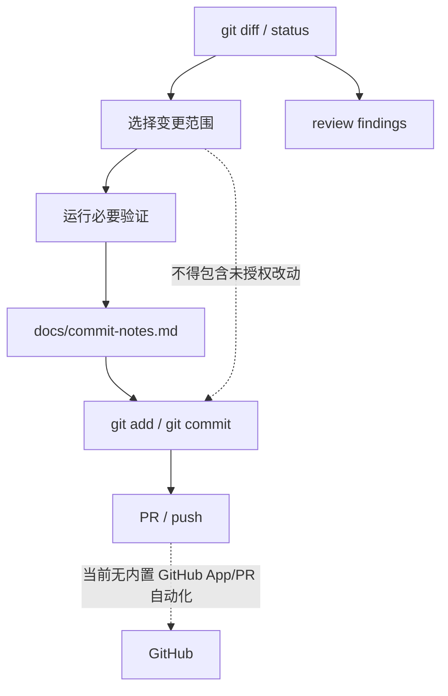

# Git / GitHub Workflow：diff、commit、PR 和自动化边界

## 学习目标

这篇模块笔记关注 Claude Code 的 Git/GitHub 命令和当前 `coding-agent` 的文档化工作流约束。重点回答：

- Git 工作流能力为什么需要比普通命令执行更严格的边界？
- commit、diff、branch、PR、GitHub App 分别涉及哪些技术面？
- 当前项目有哪些复盘和发布实践，哪些 GitHub 自动化不属于现状？

## 模块图示

## 参考文件

Claude Code：

- `<claude-code-snapshot>/src/commands/commit.ts`
- `<claude-code-snapshot>/src/commands/commit-push-pr.ts`
- `<claude-code-snapshot>/src/commands/diff/`
- `<claude-code-snapshot>/src/commands/branch/`
- `<claude-code-snapshot>/src/commands/install-github-app/`
- `<claude-code-snapshot>/src/utils/git.ts`
- `<claude-code-snapshot>/src/utils/git/`
- `<claude-code-snapshot>/src/utils/gitDiff.ts`

coding-agent：

- `docs/commit-notes.md`
- `docs/plan/p5-release-writing.md`
- `docs/plan/p7-diff-verification.md`
- `README.md`
- `CONTRIBUTING.md`
- `.github/`

## Claude Code 模块职责

Claude Code 的 Git/GitHub 工作流通常覆盖：

- 读取 git status / diff。
- 生成 commit message。
- 创建 commit、push、PR。
- 分支管理。
- diff UI。
- GitHub App 安装。
- PR 评论和 review。
- 远程 repo 映射。
- gh auth 状态。

这些能力直接影响用户仓库历史和远程协作，所以不能只当成普通 shell 命令封装。

## 技术风险

Git 自动化常见风险：

- 提交了用户未授权的文件。
- 覆盖或丢弃用户改动。
- 产生不符合项目策略的 merge commit。
- 在测试未跑或失败时生成误导性提交说明。
- 推送到错误 remote/branch。
- 把未发布能力写成已发布。
- PR 自动化缺少真实 CI 状态证据。

因此 Git 工作流需要真实 `git status`、`git diff`、测试结果和用户意图共同约束。

## coding-agent 当前状态

当前项目没有内置 Git/GitHub 工具模块。Git 操作由协作者通过普通 shell / git 命令执行，不是产品功能。

已有项目实践：

- 每次创建 commit 时，必须同步更新 `docs/commit-notes.md`。
- commit note 包含 `commit`、`time`、`Why`、`What`、`How`。
- 不能为了 notes 单独创建 notes-only commit。
- 解冲突目标如果是 rebase merge，不能默认 merge commit。
- README、License、CONTRIBUTING、Issue/PR 模板和 demo 已完成本地开源发布打磨。
- 不应描述成已经完成 npm registry 发布运营。

## docs/commit-notes.md 的技术意义

这个文件不是变更日志，而是工程复盘索引：

- Why 记录问题背景、目标和取舍。
- What 记录行为变化和架构边界变化。
- How 记录实现路径、测试方式和踩坑点。

它服务后续技术文章和分享，要求沉淀可复用设计理由，而不是流水账。

## 与 P7 的关系

P7 `diff-verification` 可以补齐 Git 工作流中的技术缺口：

- 生成变更 diff 摘要。
- 将验证结果和 diff 关联。
- 更明确地区分已改文件、未验证文件和风险。
- 为 commit / review 提供证据。

但 P7 不等同于 GitHub App 或 PR 自动化。

## 与 Claude Code 的关键差异

Claude Code 可以把 Git/GitHub 作为产品命令；当前 `coding-agent` 只有协作流程和文档约束：

- 无内置 commit command。
- 无 PR command。
- 无 GitHub App。
- 无 PR 评论机器人。
- 无自动 branch 管理。
- 无 GitHub auth 管理。

当前不应把本地能运行 `git` 或 `gh` 描述成 agent 产品能力。

## 验证策略建议

如果未来实现 Git 工作流，应测试：

- 只 add 用户目标文件。
- dirty worktree 中不 revert 无关改动。
- commit message 与 diff 一致。
- `docs/commit-notes.md` 同提交更新。
- rebase conflict 流程不产生 merge commit。
- PR 创建前检查分支、remote 和 CI 状态。
- 失败命令不被描述成成功。

## 可以借鉴的设计

- Git 命令应建立在真实状态读取上，不靠模型猜。
- review 输出应先列 findings，再给摘要。
- commit 自动化要有文件选择边界。
- PR 自动化要引用真实 check run 或 API 结果。

## 不应该照搬的设计

- 不应现在实现 GitHub App。
- 不应自动 push 或 publish。
- 不应在未确认时执行 destructive git 命令。
- 不应把文档发布准备写成 npm registry 发布完成。
