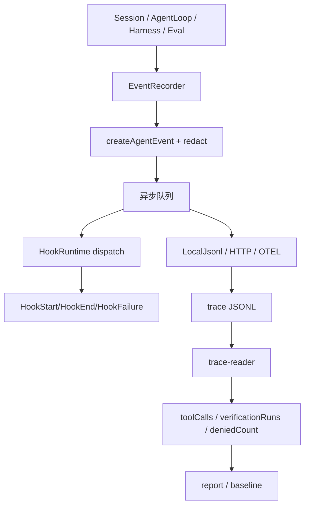

# Hooks / Observability：事件 schema、脱敏、hook 生命周期与 eval 汇总

## 学习目标

这篇模块笔记关注 Claude Code 的成本、analytics、stop hooks 和当前 `coding-agent` 的 observability / eval 实现。重点回答：

- Agent event 应该记录什么，不能记录什么？
- hooks 如何接入事件流，而不默认改变 Agent 成败？
- eval runner 如何从 trace 中提取质量指标？

## 模块图示

## 参考文件

Claude Code：

- `<claude-code-snapshot>/src/cost-tracker.ts`
- `<claude-code-snapshot>/src/costHook.ts`
- `<claude-code-snapshot>/src/services/analytics/`
- `<claude-code-snapshot>/src/services/toolUseSummary/`
- `<claude-code-snapshot>/src/services/AgentSummary/`
- `<claude-code-snapshot>/src/query/stopHooks.ts`
- `<claude-code-snapshot>/src/utils/telemetry/`

coding-agent：

- `src/observability/events.ts`
- `src/observability/recorder.ts`
- `src/observability/hooks.ts`
- `src/observability/sinks.ts`
- `src/observability/otel.ts`
- `src/evals/runner.ts`
- `src/evals/trace-reader.ts`
- `src/evals/report.ts`
- `src/evals/baseline.ts`
- `tests/observability/*.test.ts`
- `tests/evals-*.test.ts`

## Claude Code 模块职责

Claude Code 的观测体系通常覆盖：

- 模型成本和 token 使用。
- 工具使用摘要。
- analytics sink。
- telemetry。
- stop hooks。
- 用户反馈。
- session tracing。
- agent summary。

它服务产品运营、调试、质量评估和用户体验。

## coding-agent event schema

`AGENT_EVENT_TYPES` 当前包括：

- `SessionStart`
- `UserPromptSubmit`
- `LLMRequest`
- `LLMResponse`
- `PreToolUse`
- `PostToolUse`
- `PermissionRequest`
- `VerificationStart`
- `VerificationEnd`
- `Stop`
- `SessionEnd`
- `EvalTaskStart`
- `EvalTaskEnd`
- `HookStart`
- `HookEnd`
- `HookFailure`

`AgentEvent` 固定字段：

- `schemaVersion: 1`
- `id`
- `runId`
- `parentId?`
- `timestamp`
- `type`
- `payload`

`createAgentEvent()` 会创建事件、脱敏 payload、校验 schema。

## 脱敏细节

敏感 key pattern 覆盖：

- `ark_api_key`
- `api-key` / `api_key`
- `authorization`
- `token`
- `password`
- `secret`
- `credential`
- `env`

字符串脱敏覆盖：

- `Bearer ...`
- `ARK_API_KEY=...`
- `api-key=...`
- `token=...`
- `password=...`
- `secret=...`

payload 字符串会截断到 500 字符。对象和数组递归处理。

这意味着 observability event 可以记录摘要，但不能记录完整环境变量、Authorization、token、password、secret 或真实凭证。

## EventRecorder 技术细节

`EventRecorder`：

- 有 `runId`。
- 维护 sink 列表。
- 有可选 `HookRuntime`。
- `emit()` 创建事件并放入队列。
- `startDrain()` 异步 drain。
- `drainLoop()` 逐个写 sink，然后 dispatch hook。
- `HookStart` / `HookEnd` / `HookFailure` 不再触发 hook，避免递归。
- `flush()` / `close()` 支持 timeout。
- sink 失败写 stderr，不直接中断 Agent。

这个设计让 observability 默认不改变 Agent 成败。

## session 接入点

`runAgentSession()`：

- 创建 recorder。
- emit `SessionStart`。
- emit `UserPromptSubmit`。
- 调 Agent Loop。
- emit `SessionEnd`。
- finally flush/close recorder。

`runAgentLoop()`：

- emit `LLMRequest`
- emit `LLMResponse`
- emit `Stop`

`Harness`：

- emit `PreToolUse`
- emit `PostToolUse`
- emit `PermissionRequest`
- emit `VerificationStart`
- emit `VerificationEnd`

## eval 关系

eval runner 和 trace-reader 使用事件做质量汇总，例如：

- turns。
- tool calls。
- permission denied count。
- verification runs。
- feedback status。
- trace path。

baseline gate 和 report 基于这些结果生成 Markdown/dashboard 数据。但 mock eval 只能证明平台链路，不代表真实模型质量。

## 与 Claude Code 的关键差异

Claude Code 有更成熟的 analytics、成本、telemetry 和产品反馈系统；当前 `coding-agent` 已有基础 observability，但仍是学习版：

- 有本地 JSONL。
- 有 HTTP feedback sink。
- 有 OTEL sink。
- 有 hook runtime。
- 有 eval runner/report/baseline check。
- 没有正式 continuous baseline 快照。
- 没有成熟长期趋势运营数据。
- hooks 默认不阻断 Agent。

## 测试证据

当前测试包括：

- `tests/observability/events.test.ts`：schema、未知类型、脱敏、截断。
- `tests/observability/recorder.test.ts`：队列、sink 失败、hook dispatch、flush/close。
- `tests/observability/hooks.test.ts`：hook 配置和执行。
- `tests/observability/sinks.test.ts`：本地和 HTTP sink。
- `tests/observability/otel.test.ts`：OTEL sink。
- `tests/evals-runner.test.ts`、`evals-trace-reader.test.ts`、`evals-report.test.ts`、`evals-baseline.test.ts`：eval 汇总、报告和门禁。

## 可以借鉴的设计

- 如果后续增加成本追踪，应保持敏感信息脱敏。
- Stop event 可以扩展更多 finalState，但必须测试。
- hooks 如果要支持阻断，必须设计 transition 和恢复语义。
- eval 指标要区分平台链路和真实模型能力。

## 不应该照搬的设计

- 不应把 observability 当作安全机制替代权限校验。
- 不应记录完整 prompt、环境变量或凭证。
- 不应把 mock eval 结果宣传成真实能力。
- 不应把 hooks 直接升级成阻断执行能力。
