# Module Notes

这里放按子模块拆分的 Claude Code 学习笔记。模块笔记比 `architecture/` 更贴近文件和组件职责，但仍以架构级分析为主，不做逐行源码复述。

## 阅读地图

```mermaid
flowchart TD
  Core["核心闭环"] --> Query["Query / Agent Loop"]
  Core --> Tool["Tool 类型与注册"]
  Core --> FileCmd["文件与命令工具"]
  Core --> Context["Context"]
  Core --> Permission["Permission / Harness"]
  Extension["扩展能力"] --> Skill["SkillTool / Skills"]
  Extension --> MCP["MCP / LSP / API / OAuth"]
  Extension --> Plugin["Plugin System"]
  Extension --> Task["Task / AgentTool"]
  Product["产品化外围"] --> Bridge["Bridge / Remote / Server"]
  Product --> State["State / Memory / Config"]
  Product --> CLI["CLI / Commands / TUI"]
  Product --> IO["Input / Output UX"]
  Product --> Git["Git / GitHub Workflow"]
  Product --> Obs["Hooks / Observability"]
```

## 章节导航

- [Query / Agent Loop](/modules/query-agent-loop)
- [Tool 类型与注册](/modules/tool-types-registry)
- [文件与命令工具](/modules/file-command-tools)
- [Context](/modules/context)
- [Permission / Harness](/modules/permission-harness)
- [SkillTool / Skills](/modules/skill-tool-skills)
- [MCP / LSP / API / OAuth](/modules/mcp-lsp-api-oauth)
- [Plugin System](/modules/plugin-system)
- [Bridge / Remote / Server](/modules/bridge-remote-server)
- [State / Memory / Config](/modules/state-memory-config)
- [Task / AgentTool](/modules/task-agent-tool)
- [CLI / Commands / TUI](/modules/cli-commands-tui)
- [Input / Output UX](/modules/input-output-ux)
- [Git / GitHub Workflow](/modules/git-github-workflow)
- [Hooks / Observability](/modules/hooks-observability)

## 对比口径

- `coding-agent` 的工具协议必须保持模型 API 协议和运行时协议分离。
- `Agent Loop` 的真实执行路径必须保持 tool call -> Harness -> ToolRegistry -> tool message。
- `run_command` 当前只有工作目录、超时和基础危险命令规则，不能描述成完整命令沙箱。
- `write_file` 当前会覆盖已有文件，不能描述成无风险合并写入。
- 子 Agent、插件市场、完整 RAG、完整 OS 级沙箱仍不属于当前已实现能力。
