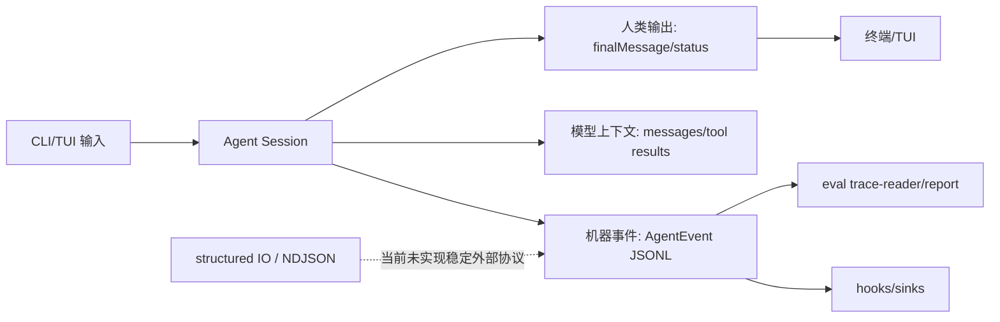

# Input / Output UX：结构化输出、快捷键和机器可读通道

## 学习目标

这篇模块笔记关注 Claude Code 的输入输出体验模块，以及当前 `coding-agent` 的 CLI/TUI 输出和 observability trace。重点回答：

- 人类可读输出、模型上下文和机器可读事件为什么要分层？
- 快捷键、Vim、语音、output style、structured IO 分别属于哪些技术面？
- 当前项目已有的输出能力和缺失的 I/O 协议边界是什么？

## 模块图示

## 参考文件

Claude Code：

- `<claude-code-snapshot>/src/keybindings/`
- `<claude-code-snapshot>/src/vim/`
- `<claude-code-snapshot>/src/voice/`
- `<claude-code-snapshot>/src/outputStyles/`
- `<claude-code-snapshot>/src/constants/outputStyles.ts`
- `<claude-code-snapshot>/src/cli/structuredIO.ts`
- `<claude-code-snapshot>/src/cli/ndjsonSafeStringify.ts`
- `<claude-code-snapshot>/src/cli/print.ts`

coding-agent：

- `src/index.ts`
- `src/tui/app.tsx`
- `src/observability/events.ts`
- `src/observability/sinks.ts`
- `src/evals/report.ts`
- `tests/index.test.ts`
- `tests/tui/app.test.tsx`
- `tests/observability/events.test.ts`

## Claude Code 模块职责

Claude Code 的 I/O 体验覆盖：

- keybindings 加载、解析、校验和冲突处理。
- Vim motions/operators/text objects。
- voice mode 和语音服务。
- output style 加载和切换。
- structured IO。
- NDJSON 安全序列化。
- CLI print 和 remote IO。

这些模块服务不同消费者：

- 人类：TUI、彩色输出、快捷键。
- 脚本：结构化 stdout、NDJSON。
- 远程/SDK：事件协议。
- 模型：消息上下文和 tool result。

## coding-agent 当前输出层

当前项目主要有三类输出。

### CLI 用户输出

`handleUserInput()` 会输出：

- `finalMessage`
- `todoDisplay`
- `[CLI] Tools called: ...`
- `[CLI] Stopped after ... turns`
- `Error: ...`

这是人类可读输出，不是稳定机器协议。

### TUI transcript

`TuiApp` 把消息分为：

- `user`
- `assistant`
- `status`
- `error`

它用于屏幕展示，也不是稳定机器协议。

### observability JSONL

`EventRecorder` 和 `LocalJsonlSink` 写事件，事件包括：

- `SessionStart`
- `UserPromptSubmit`
- `LLMRequest`
- `LLMResponse`
- `PreToolUse`
- `PostToolUse`
- `PermissionRequest`
- `VerificationStart`
- `VerificationEnd`
- `Stop`
- `SessionEnd`
- eval 和 hook 事件

这是当前最接近机器可读通道的部分，但它定位是 observability trace，不是公共 SDK API。

## 输入层细节

CLI 输入：

- flag 剥离。
- prompt 拼接。
- `.exit` 特殊处理。

TUI 输入：

- 单行编辑。
- 光标移动。
- Ctrl 快捷键。
- 权限 prompt 时输入被 y/n 接管。
- Agent 运行中普通输入被忽略。

当前没有：

- Vim mode。
- 语音输入。
- keybinding 配置文件。
- output style。
- structured stdout / NDJSON mode。
- remote IO。

## 机器可读输出风险

如果未来把 JSONL 或 stdout 作为机器协议，需要明确：

- schema version。
- 事件排序。
- stdout/stderr 分离。
- 文本是否包含 ANSI。
- 错误如何编码。
- 是否包含敏感信息。
- 是否保证 backward compatibility。

当前 `AgentEvent` 有 `schemaVersion: 1` 和脱敏，但 trace 仍是内部观测，不应直接承诺为稳定外部 API。

## 与 Claude Code 的关键差异

Claude Code 的 I/O 体验模块面向成熟 CLI/SDK 产品；当前 `coding-agent` 只具备：

- 基础 CLI。
- 基础 TUI。
- 基础快捷编辑。
- JSONL trace。
- eval report。

当前没有产品级输入法、输出风格、结构化 CLI 协议或远程事件传输。

## 测试证据

当前测试覆盖：

- `tests/index.test.ts`：CLI 参数和输出流程。
- `tests/tui/app.test.tsx`：TUI 输入和展示。
- `tests/tui/permission.test.tsx`：权限输入。
- `tests/observability/events.test.ts`：event schema 和脱敏。
- `tests/evals-report.test.ts`：报告输出。

## 可以借鉴的设计

- 未来可以增加 `--json` 或 `--ndjson`，但必须定义稳定 schema。
- TUI 快捷键可以逐步配置化。
- output style 应只影响最终表达，不应改变安全或工具协议。
- voice / Vim 这类体验能力应排在核心协议和权限之后。

## 不应该照搬的设计

- 不应把 trace JSONL 当成稳定 SDK。
- 不应把彩色 TUI 输出混入机器可读通道。
- 不应为了体验功能绕过 `.exit`、flag 剥离和权限确认。
- 不应声称当前支持 Vim、语音或 output styles。
