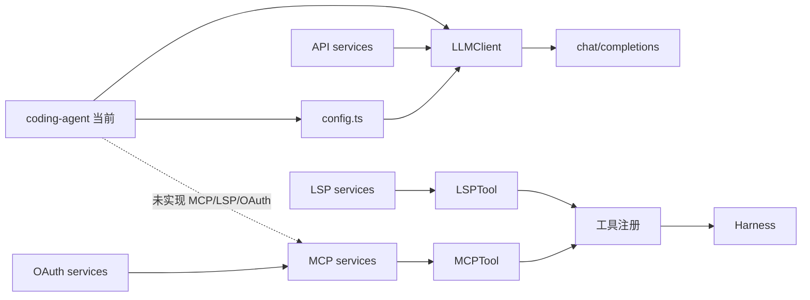

# MCP / LSP / API / OAuth：外部服务连接和能力映射

## 学习目标

这篇模块笔记关注 Claude Code 的服务层，包括 MCP、LSP、模型 API 和 OAuth。重点回答：

- 外部服务为什么要有独立模块，而不是写在具体工具里？
- MCP / LSP / API / OAuth 各自承担什么技术职责？
- 当前 `coding-agent` 的服务层为什么只有 OpenAI-compatible LLM Client 和配置读取？

## 模块图示



## 参考文件

Claude Code：

- `<claude-code-snapshot>/src/services/mcp/`
- `<claude-code-snapshot>/src/services/lsp/`
- `<claude-code-snapshot>/src/services/api/`
- `<claude-code-snapshot>/src/services/oauth/`
- `<claude-code-snapshot>/src/tools/MCPTool/MCPTool.ts`
- `<claude-code-snapshot>/src/tools/LSPTool/LSPTool.ts`
- `<claude-code-snapshot>/src/tools/McpAuthTool/McpAuthTool.ts`
- `<claude-code-snapshot>/src/services/api/withRetry.ts`

coding-agent：

- `src/llm-client.ts`
- `src/config.ts`
- `src/tools/index.ts`
- `src/observability/events.ts`
- `docs/plan/p10-mcp-plugin-tools.md`
- `tests/llm-client.test.ts`
- `tests/config.test.ts`

## Claude Code 模块职责

### MCP

MCP 服务层通常负责：

- 读取 MCP server 配置。
- 建立 stdio、HTTP、SDK control 或 in-process transport。
- 管理连接生命周期。
- 处理认证、channel allowlist 和权限。
- 将 MCP server 暴露的工具归一化为 Claude Code 可用工具。
- 处理资源读取、工具调用、elicitation 和错误。

### LSP

LSP 服务层通常负责：

- 启动或连接语言服务器。
- 管理 server instance。
- 收集 diagnostics。
- 提供符号、跳转、引用或语言语义能力。
- 把 LSP 能力包装成工具或上下文。

### API

API 服务层通常负责：

- 模型 API 客户端。
- 请求重试。
- 错误分类。
- usage 和配额信息。
- 文件 API、session ingress、metrics opt-out 等产品服务。

### OAuth

OAuth 服务层通常负责：

- 授权码监听。
- token 获取和刷新。
- profile 读取。
- 与 MCP 或第三方服务认证集成。

这些模块共同特点是都有连接状态、认证状态、错误状态和生命周期，不适合散落在工具实现里。

## coding-agent 当前实现

当前项目只有一个模型 API 客户端：

`LLMClient.sendMessage(messages, options)`：

- 读取 `AppConfig` 中的 `apiKey`、`baseURL`、`model`。
- 请求 `${baseURL}/chat/completions`。
- headers 包含 `Authorization: Bearer ${apiKey}`。
- body 包含 `model`、`messages`、可选 `tools`、`temperature`、`max_tokens`。
- 网络错误抛 `LLM request failed: network error`。
- HTTP 非 2xx 抛 `LLM request failed: status statusText`，附带响应正文。
- 响应正文先读 text，再 JSON.parse。
- `parseResponse()` 提取 text、finish reason 和 tool calls。

`config.ts` 负责：

- `ARK_API_KEY` 必填。
- `ARK_MODEL` 必填。
- `BASE_URL` 有默认值。
- `MAX_TURNS` 正整数校验。
- observability / feedback / otel 配置读取。
- CLI overrides 优先于环境变量。

当前没有：

- MCP client。
- LSP client。
- OAuth。
- 多模型适配层。
- API retry。
- 外部服务工具映射。

## 数据流 / 控制流

当前模型 API 链路：

```text
loadConfig()
-> LLMClient(config)
-> sendMessage(messages, { tools })
-> fetch(baseURL/chat/completions)
-> JSON.parse response
-> parseResponse()
-> Agent Loop 使用 ParsedResponse
```

未来 MCP 式链路可以是：

```text
读取扩展配置
-> 建立 MCP server 连接
-> 拉取工具 schema
-> 转为 runtime ToolDefinition
-> ToolRegistry 注册
-> Agent Loop 正常发送 schema
-> Harness 执行 MCP-backed tool
```

## 错误与敏感信息边界

当前 `LLMClient` 会打印请求摘要和响应正文。模块笔记需要诚实记录这一点，同时不能把敏感材料写进文档或 trace。observability 层有脱敏逻辑，但普通 console log 不是完整安全审计边界。

服务层扩展时必须注意：

- API key / OAuth token 不能进入模型上下文。
- trace 和 hook payload 必须脱敏。
- MCP server 返回错误时要结构化回传模型，而不是泄露凭证。
- retry 需要区分网络错误、认证错误、协议错误和模型错误。

## 与 Claude Code 的关键差异

Claude Code 的服务层是产品集成面，当前 `coding-agent` 是单 API 客户端：

- 无 MCP 工具动态发现。
- 无 LSP 语义服务。
- 无 OAuth。
- 无服务连接池或 lifecycle manager。
- 无多 endpoint retry 策略。

当前的好处是简单：模型请求路径和工具执行路径都清晰，测试可以直接 mock fetch 或 config。

## 测试证据

当前测试主要覆盖：

- `tests/llm-client.test.ts`：请求 body、headers、tools、错误响应、JSON 解析、tool arguments 解析失败。
- `tests/config.test.ts`：必填字段、默认值、环境变量、overrides、非法正整数、observability 配置。
- `tests/observability/events.test.ts`：敏感 payload 脱敏。

## 可以借鉴的设计

- P10 如果实现 MCP，应先做最小 lifecycle：配置读取、连接、工具映射、调用、断开。
- 服务层不应直接污染工具实现；工具只依赖抽象 client。
- 认证材料必须留在配置/secret 层。
- 外部服务错误应有可测试分类。

## 不应该照搬的设计

- 不应在没有需求时实现完整 MCP/LSP/OAuth 生态。
- 不应让工具直接读取环境变量或 token。
- 不应把 Claude Code 的外部服务能力写成本项目现状。
- 不应引入多模型适配层后仍保留静默默认模型；`ARK_MODEL` 必须保持必填。
