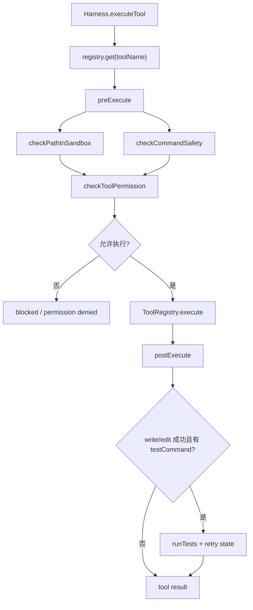

# Permission / Harness：权限、安全、执行和验证的统一边界

## 学习目标

这篇模块笔记关注 Claude Code 的权限模块与当前 `coding-agent` 的 Harness。重点回答：

- 为什么权限、安全规则和工具执行需要集中在 Harness，而不是散落在工具里？
- `autoApprove` 跳过了什么，又没有跳过什么？
- 编辑后验证和重试状态如何接入 tool result 回传链路？

## 模块图示



## 参考文件

Claude Code：

- `<claude-code-snapshot>/src/hooks/useCanUseTool.tsx`
- `<claude-code-snapshot>/src/types/permissions.js`
- `<claude-code-snapshot>/src/utils/permissions/`
- `<claude-code-snapshot>/src/tools/BashTool/bashPermissions.ts`
- `<claude-code-snapshot>/src/utils/sandbox/`

coding-agent：

- `src/harness.ts`
- `src/permissions/categories.ts`
- `src/permissions/index.ts`
- `src/permissions/rules.ts`
- `src/permissions/sandbox.ts`
- `src/verification/test-runner.ts`
- `src/verification/format-results.ts`
- `src/verification/retry-loop.ts`
- `tests/harness.test.ts`
- `tests/agent-loop-permission.test.ts`
- `tests/permissions/*.test.ts`
- `tests/verification/*.test.ts`

## Claude Code 模块职责

Claude Code 的权限系统需要处理：

- 权限模式和自动模式。
- 工具级权限分类。
- Bash 命令分类、只读判定、危险模式和 sandbox。
- 文件路径访问规则。
- 用户确认 UI。
- 权限更新、拒绝跟踪和规则解析。
- 插件、MCP、Skill 等动态工具来源。

它是产品安全边界的一部分，并且和 UI、设置、shell 解析、远程权限回调协作。

## coding-agent Harness 职责

当前 `Harness` 是真实工具执行的统一入口，接口是：

```ts
interface HarnessLike {
  beginTurn(): void;
  executeTool(toolName, input, tools, modelAction): Promise<HarnessExecutionResult>;
  endTurn(): void;
}
```

`Harness.executeTool()` 内部顺序：

1. 从 `ToolRegistry` 查运行时工具。
2. emit `PreToolUse`。
3. 调 `preExecute(tool, input)`。
4. 如果安全或权限拒绝，返回拒绝文本，不执行工具。
5. 调 `tools.execute(toolName, input)`。
6. 用 `formatToolResult()` 把 `ToolResult` 变成 tool message content。
7. 调 `postExecute(toolName, result, modelAction)`。
8. emit `PostToolUse`。
9. 返回 `{ content, verificationMessage? }`。

所有异常都会被 catch，转成 `{ content: "[error] ..." }`。

## preExecute 技术细节

`preExecute()` 先做代码级 safety，再做用户权限：

```text
checkToolSafety(tool, input)
-> checkToolPermission(tool, input, { autoApprove })
-> emit PermissionRequest
```

### 路径工具

`REQUIRED_PATH_TOOL_NAMES`：

- `read_file`
- `write_file`
- `edit_file`

这些工具必须有可通过 `checkPathInSandbox(workingDirectory, input.path)` 的路径。

`OPTIONAL_PATH_TOOL_NAMES`：

- `grep`
- `glob`

这些工具没有传 `path` 时用 `"."` 做 sandbox 检查。

### 命令工具

`run_command` 调 `checkCommandSafety(input.command)`。当前基础规则包括：

- `rm -rf`
- `curl` / `wget` 外部网络请求
- `git push --force` / `--force-with-lease`
- 写入 `/etc`、`/usr`、`/var`
- `sudo`
- `chmod 777`

这不是完整 shell parser，也不是完整命令安全策略。

### 权限确认

`checkToolPermission()`：

- `autoApprove === true` 时直接批准。
- `read` 类工具直接批准。
- `write` / `command` 类工具走 `PermissionIO.question()`。
- 用户非 `y` 则返回 `Cancelled by user`。

重要边界：`autoApprove` 只跳过人工确认。它不会跳过路径 sandbox、危险命令规则、工具参数校验或工具错误回传。

## postExecute 技术细节

`postExecute()` 只对成功的编辑工具做验证：

- 编辑工具集合：`write_file`、`edit_file`。
- 如果 `result.error !== undefined`，不验证。
- 如果不是编辑工具，不验证。
- 如果没有 `testCommand`，不验证。
- 否则 emit `VerificationStart`。
- 调 `testRunner(testCommand, workingDirectory)`。
- 用 `formatTestResults(testResult)` 生成摘要。
- 用 `recordVerificationAttempt()` 更新 `RetryState`。
- emit `VerificationEnd`。
- 返回 `verification.nextMessage`，由 Agent Loop 追加为 assistant 消息。

`beginTurn()` 会把 `editedThisTurn` 置 false；`endTurn()` 如果本轮没有编辑，会重置 retry state。这个设计让连续修复循环保留验证失败上下文，而非编辑轮次不会错误继承 retry 状态。

## 数据流 / 控制流

```text
Agent Loop 收到 tool call
-> Harness.beginTurn()
-> Harness.executeTool()
-> checkToolSafety()
-> checkToolPermission()
-> ToolRegistry.execute()
-> postExecute()
-> optional testRunner()
-> optional verificationMessage
-> Agent Loop 写 role=tool
-> Agent Loop 写 verification assistant message
-> Harness.endTurn()
```

## 与 Claude Code 的关键差异

Claude Code 权限系统更完整：

- 更丰富的权限模式和设置来源。
- 更复杂的 Bash 语义分类。
- 更成熟的 UI 提示和权限解释。
- 远程/IDE 权限回调。
- 插件/MCP/Skill 动态工具权限。

当前 `coding-agent` 的目标是单一路径可测试：

- Harness 是唯一真实执行入口。
- 安全规则集中。
- 权限确认集中。
- 编辑后验证集中。
- observability 事件集中。

当前没有完整 OS 级沙箱，也没有成熟命令安全策略。

## 测试证据

关键测试包括：

- `tests/harness.test.ts`：工具执行、权限拒绝、安全拦截、验证触发。
- `tests/agent-loop-permission.test.ts`：Agent Loop 经 Harness 执行工具。
- `tests/permissions/sandbox.test.ts`：绝对路径和逃逸路径拒绝。
- `tests/permissions/rules.test.ts`：危险命令规则。
- `tests/permissions/index.test.ts`：read 自动允许、write/command 确认、autoApprove。
- `tests/verification/test-runner.test.ts`、`format-results.test.ts`、`retry-loop.test.ts`：测试执行、摘要和重试状态。

## 可以借鉴的设计

- P8 可以逐步强化命令安全规则，并为每条规则补误伤测试。
- P12 可以增加 workspace trust，但不能让 trust 绕过代码级校验。
- 权限提示可以变得更可解释，例如展示写入路径、命令类别和风险原因。
- 如果引入远程/IDE 权限回调，Harness 仍应是最终执行边界。

## 不应该照搬的设计

- 不应只靠系统提示词约束危险操作。
- 不应让每个工具自己实现一套权限确认。
- 不应把 `run_command` 描述成任意命令安全执行。
- 不应让 hooks 或 UI 层直接决定工具执行而绕过 Harness。
