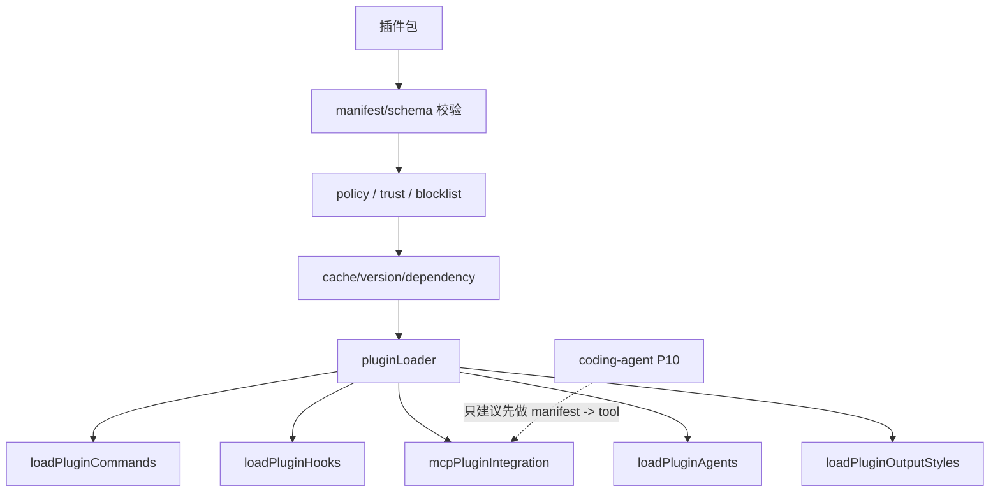

# Plugin System：安装、信任、市场与扩展出口

## 学习目标

这篇模块笔记关注 Claude Code 的插件系统。重点回答：

- 插件系统的技术组成为什么远不止“加载一个目录”？
- 插件可以扩展哪些出口：命令、hooks、MCP、agents、output styles？
- 当前 `coding-agent` 如果做 P10，应该从哪一个最小出口开始？

## 模块图示



## 参考文件

Claude Code：

- `<claude-code-snapshot>/src/plugins/`
- `<claude-code-snapshot>/src/plugins/builtinPlugins.ts`
- `<claude-code-snapshot>/src/plugins/bundled/`
- `<claude-code-snapshot>/src/services/plugins/`
- `<claude-code-snapshot>/src/commands/plugin/`
- `<claude-code-snapshot>/src/utils/plugins/`
- `<claude-code-snapshot>/src/cli/handlers/plugins.ts`

coding-agent：

- `src/tools/index.ts`
- `src/observability/hooks.ts`
- `src/config.ts`
- `docs/plan/p10-mcp-plugin-tools.md`
- `docs/plan/p12-config-policy-governance.md`

## Claude Code 模块职责

Claude Code 插件系统覆盖多个技术面：

- 插件 manifest 和 schema 校验。
- 官方 marketplace 和自定义 marketplace。
- 插件安装、卸载、更新、缓存、版本和依赖解析。
- 插件 trust warning 和 policy。
- 加载插件 commands。
- 加载插件 hooks。
- 加载插件 agents。
- 加载插件 output styles。
- MCP 插件集成。
- LSP 插件推荐。
- startup check、blocklist、telemetry 和错误展示。

这说明插件系统本质上是扩展治理平台，而不是一个工具注册函数。

## Claude Code 典型链路

```text
读取 marketplace / 本地插件源
-> 下载或定位插件包
-> 解压、缓存、校验 manifest
-> 检查 policy、blocklist、版本和依赖
-> 用户确认 trust
-> 按出口加载 commands/hooks/MCP/agents/output styles
-> 注册到对应运行时
-> 会话中使用并记录 telemetry / errors
```

## 技术出口拆分

插件至少可能影响这些出口：

- `commands`：扩展 CLI/TUI 命令。
- `hooks`：监听生命周期事件。
- `MCP`：注册外部 MCP server 或工具。
- `agents`：提供子 Agent 角色。
- `output styles`：改变回复风格。
- `skills`：携带任务工作流说明。

每个出口都应有单独边界，不能因为插件被信任就允许任意修改核心运行时。

## coding-agent 当前状态

当前项目没有：

- 插件目录。
- 插件 manifest。
- 插件市场。
- 插件安装/更新。
- 插件命令。
- 插件 agent。
- 插件 output style。
- 插件 MCP 集成。

当前已有的相关基础是：

- 固定 `ToolRegistry`。
- hooks runtime，但主要服务 observability。
- config 读取。
- P10 插件式工具扩展计划。
- P12 配置策略治理计划。

## P10 最小可行切入点

对当前项目来说，最小插件式能力应从“扩展工具 manifest”开始，而不是 marketplace：

```text
读取本地 manifest
-> 校验 name/description/parameters/category/command template
-> 转为 runtime ToolDefinition
-> 注册到 ToolRegistry
-> 执行时走 Harness
-> 输入通过 JSON stdin，不拼进 shell 字符串
```

这个切入点能复用已有边界：

- 模型 schema / runtime execute 分离。
- Harness 权限和命令规则。
- observability 事件。
- registry 集成测试。

## 风险与失败模式

插件系统的主要风险：

- 未信任代码执行。
- 插件绕过权限和 Harness。
- manifest 欺骗模型或用户。
- 插件 hook 修改 Agent 成败。
- marketplace 供应链风险。
- 插件版本和配置迁移破坏历史行为。

所以当前阶段应避免把“插件市场”作为目标，只做可审计的本地扩展工具。

## 与 Claude Code 的关键差异

Claude Code 插件系统是产品级生态；当前 `coding-agent` 仍是本地学习版：

- 无 marketplace。
- 无自动安装和更新。
- 无 trust 平台。
- 无插件命令或 agents。
- hooks 不作为插件能力暴露。

当前只适合沉淀插件治理原则，并在 P10 做很小的 manifest -> tool 路径。

## 测试策略建议

当前 `coding-agent` 没有插件系统，因此没有对应实现测试。P10 如果实现插件式工具扩展，应至少覆盖：

- manifest schema 校验：缺字段、非法 name、非法 category、非法 parameters。
- 扩展工具导出的模型 schema 不包含 `execute`、`category` 或运行时字段。
- 扩展工具执行必须经过 Harness，不能直接调用命令。
- 输入通过 JSON stdin 传入，不能拼接进 shell 字符串。
- 未 trust 或未启用的扩展不能注册工具。
- 插件/扩展加载失败不影响默认工具注册。
- hooks、commands、agents、output styles 等出口未实现时不能被 manifest 暗中启用。
- trace 和错误消息必须脱敏，不记录凭证或完整环境变量。

## 可以借鉴的设计

- 插件出口要拆分治理，不要全部挂在一个“扩展执行”入口。
- manifest 必须 schema 校验。
- 信任确认必须早于执行能力。
- 插件工具必须走 `ToolRegistry.getToolDefinitions()` 和 Harness。
- 插件失败应隔离，不能默认让主会话崩溃。

## 不应该照搬的设计

- 不应实现插件市场、依赖解析、自动更新和统计。
- 不应让插件任意改系统提示词。
- 不应让插件 hooks 默认阻断或修改 Agent 成败。
- 不应把 P10 描述成完整插件系统。
