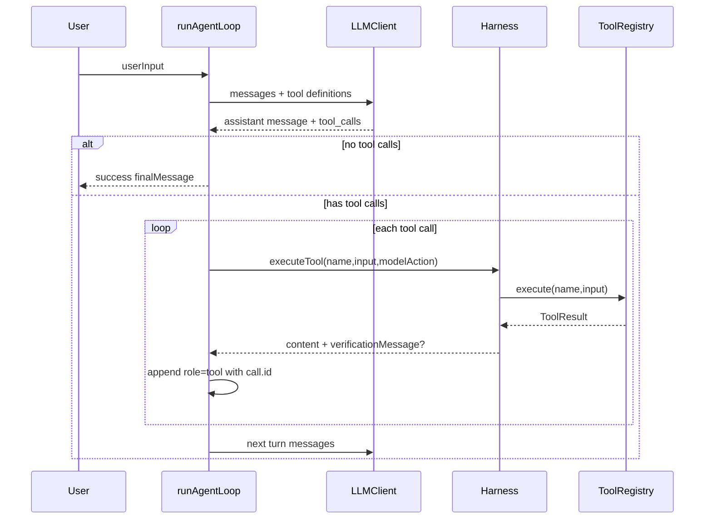

# Query / Agent Loop：模型请求、工具调用与停止条件

## 学习目标

这篇模块笔记关注 Claude Code 的 `query` / `QueryEngine` 与当前 `coding-agent` 的 `runAgentLoop`。重点不是复述主循环，而是拆清楚几个技术细节：

- 一轮模型请求需要带哪些消息、工具 schema 和运行时状态？
- assistant tool use 如何变成真实工具执行，又如何回到下一轮模型上下文？
- 哪些错误应进入 tool message，哪些错误目前会中断循环？
- 当前学习版 Agent Loop 的边界为什么比 Claude Code 小很多？

## 模块图示



## 参考文件

Claude Code：

- `<claude-code-snapshot>/src/query.ts`
- `<claude-code-snapshot>/src/QueryEngine.ts`
- `<claude-code-snapshot>/src/query/deps.ts`
- `<claude-code-snapshot>/src/query/config.ts`
- `<claude-code-snapshot>/src/query/stopHooks.ts`
- `<claude-code-snapshot>/src/query/tokenBudget.ts`

coding-agent：

- `src/agent-loop.ts`
- `src/llm-client.ts`
- `src/harness.ts`
- `src/context/compressor.ts`
- `src/context/message-history.ts`
- `tests/agent-loop.test.ts`
- `tests/integration/p1-end-to-end.test.ts`

## Claude Code 模块职责

Claude Code 的 Query 层是产品级会话运行时，核心职责包括：

- 构造每轮模型请求的消息视图。
- 处理流式模型输出和 partial assistant message。
- 收集 tool use blocks，并触发工具执行。
- 保证 tool use / tool result 在消息协议上成对。
- 处理 compact、token budget、stop hooks、fallback、附件和中断恢复。
- 把运行状态发送给 UI、SDK、trace、analytics 和任务系统。

`QueryEngine` 可以理解为更靠近“执行引擎”的封装，`query.ts` 则把系统上下文、工具上下文、UI 回调、错误恢复和结果流组织起来。它服务的是多个入口：CLI、TUI、子 Agent、远程桥接和 SDK，所以状态面比学习版更大。

## coding-agent 模块职责

`src/agent-loop.ts` 的主函数是：

```ts
runAgentLoop(userInput, config, tools, client, harness, logger, compressor, recorder)
```

它只做当前最小闭环：

- 初始化 `MessageHistory`，放入 `SYSTEM_PROMPT` 和用户输入。
- 从 `ToolRegistry.getToolDefinitions()` 获取模型可见 OpenAI-compatible 工具 schema。
- 每轮开始调用 `activeHarness.beginTurn()`。
- 必要时通过 `HistoryCompressor` 压缩历史。
- 通过 `withTodoContext()` 把 TODO 状态作为额外 system message 注入。
- 调用 `LLMClient.sendMessage(messages, { tools })`。
- 把 assistant message 追加到真实历史。
- 用 `parseResponse()` 提取 `toolCalls`。
- 没有 tool calls 时返回 `success: true`。
- 有 tool calls 时逐个调用 `HarnessLike.executeTool()`。
- 用模型返回的真实 `call.id` 写入 `role: "tool"` 消息。
- 如果 Harness 返回 `verificationMessage`，追加为 assistant 消息，给下一轮模型看。
- 循环耗尽时返回 `success: false`。

## 关键类型与状态

`AgentResult` 是当前循环的外部返回：

- `finalMessage`：最后一次 assistant 文本。
- `turnsUsed`：实际使用轮数，或 max turns。
- `toolsCalled`：按顺序记录工具名。
- `success`：无工具调用自然结束为 `true`，达到 max turns 为 `false`。
- `totalTokens`：累加 LLM usage。
- `todoDisplay`：最终 TODO 展示文本，可选。

循环内部重要状态：

- `history`：真实消息历史，是下一轮请求的来源。
- `toolDefinitions`：进入模型请求的 schema，循环开始前生成一次。
- `lastText`：最近一次 assistant content。
- `lastModelAction`：用于验证失败时构造反馈上下文。
- `totalTokens`：累计 usage。
- `activeHarness`：真实工具执行边界。

## 数据流 / 控制流

```text
用户输入
-> MessageHistory(system + user)
-> for turn = 1..maxTurns
-> beginTurn()
-> compressor.shouldCompress(history)
-> compressor.compress(history) 并 replace
-> withTodoContext(history.getMessages(), todoManager)
-> emit LLMRequest
-> client.sendMessage(messages, tools)
-> history.append(assistantMessage)
-> parseResponse(response)
-> emit LLMResponse
-> 无 toolCalls：emit Stop(no_tool_calls)，返回 success=true
-> 有 toolCalls：对每个 call 调 Harness.executeTool()
-> history.append(role=tool, tool_call_id=call.id, content=result.content)
-> 可选追加 verificationMessage
-> endTurn()
-> 超过 maxTurns：emit Stop(max_turns)，返回 success=false
```

## 失败路径细节

当前 `coding-agent` 明确区分两类失败：

- 工具执行失败：由 `Harness.executeTool()` 捕获，转成 `{ content: "[error] ..." }`，作为 tool message 回传给模型。这保留了模型继续修复的机会。
- 协议外失败：例如 LLM 网络错误、LLM JSON 解析失败、压缩调用失败，会向外抛出，由 session 层记录 `SessionEnd(success=false)`。这类失败当前不会被包装成模型可消费消息。

还有几个重要边界：

- `parseResponse()` 对 tool arguments 的 JSON 解析失败会显式抛错，禁止静默变成 `{}`。
- 模型回复无 tool calls 时，Agent Loop 必须停止并返回成功。
- 达到 `maxTurns` 时必须停止并返回失败。
- Agent Loop 不直接调用 `ToolRegistry.execute()`，只通过 Harness。

## 测试证据

当前关键测试覆盖：

- `tests/agent-loop.test.ts`：无工具调用停止、多轮工具调用、真实 `tool_call.id`、max turns、Harness 边界、Stop event。
- `tests/agent-loop-permission.test.ts`：权限路径进入 Harness。
- `tests/agent-loop-verification.test.ts`：编辑后验证消息进入后续上下文。
- `tests/agent-loop-retry.test.ts`：验证失败和重试状态。
- `tests/integration/p1-end-to-end.test.ts`：最小读写工具闭环。

## 与 Claude Code 的关键差异

Claude Code 的 Query 层是状态机，处理流式 UI、token budget continuation、stop hooks、fallback、附件、中断和远程/SDK 消费者。当前 `coding-agent` 是协议闭环，优先保证：

- OpenAI-compatible tool_calls 协议正确。
- tool call -> Harness -> ToolRegistry -> tool message 路径单一。
- 停止条件简单可测。
- 工具失败可回传模型。

当前不实现：

- 流式响应。
- 多 terminal reason 状态机。
- prompt too long / max output tokens 自动恢复。
- stop hook 阻断后续跑。
- 子 Agent 或远程会话运行时。

## 可以借鉴的设计

- 后续扩展 final state 时，可以先增加少量结构化状态，例如 `llm_error`、`compression_error`、`interrupted`。
- 任何会产生 assistant tool call 的异常路径，都必须补齐 tool result 或明确终止，避免破坏协议。
- 如果引入流式输出，应先设计 partial tool call 的恢复策略。
- 如果 P11 引入子 Agent，应复用现有 `runAgentLoop`，但用独立 `MessageHistory`。

## 不应该照搬的设计

- 不应把当前 `for` 循环提前改成大型 `while true` 状态机。
- 不应在没有远程、SDK、MCP、Skill 需求时引入 Claude Code 的完整 Query 状态面。
- 不应让 stop hooks 或 UI 层绕过 Harness 改变真实工具执行路径。
