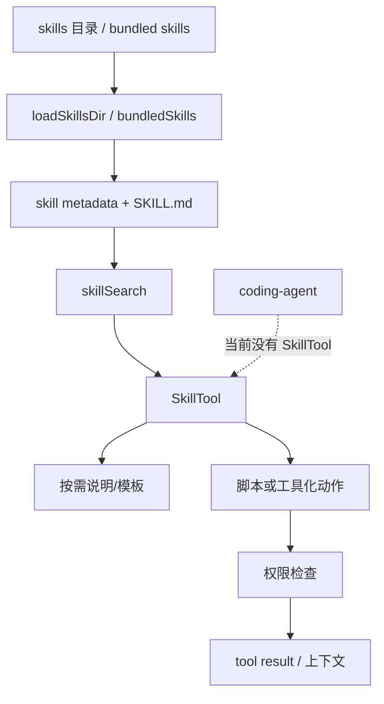

# SkillTool / Skills：可发现能力、模板和脚本的工具化入口

## 学习目标

这篇模块笔记关注 Claude Code 的 `SkillTool`、`skills/` 和技能发现服务。重点回答：

- Skill 和普通工具、系统提示词有什么技术边界？
- Skill 加载、发现、执行和权限请求之间如何协作？
- 当前 `coding-agent` 为什么只能把 Skill 作为后续规划，而不能写成已实现能力？

## 模块图示



## 参考文件

Claude Code：

- `<claude-code-snapshot>/src/tools/SkillTool/SkillTool.ts`
- `<claude-code-snapshot>/src/tools/SkillTool/prompt.ts`
- `<claude-code-snapshot>/src/tools/SkillTool/constants.ts`
- `<claude-code-snapshot>/src/skills/loadSkillsDir.ts`
- `<claude-code-snapshot>/src/skills/bundledSkills.ts`
- `<claude-code-snapshot>/src/skills/mcpSkillBuilders.ts`
- `<claude-code-snapshot>/src/services/skillSearch/`
- `<claude-code-snapshot>/src/utils/hooks/registerSkillHooks.ts`

coding-agent：

- `src/tools/index.ts`
- `src/tools/types.ts`
- `src/harness.ts`
- `docs/plan/p10-mcp-plugin-tools.md`
- `docs/plan/p11-multi-agent-orchestration.md`

## Claude Code 模块职责

Skill 系统把一组能力从主提示词中拆出来，以独立目录或 bundle 的形式维护。一个 Skill 通常可能包含：

- `SKILL.md` 或等价说明。
- 触发条件和使用指导。
- 脚本。
- 模板。
- 示例。
- 资源文件。
- 与 MCP 或插件来源的适配。

`SkillTool` 的技术意义是把“按需使用某项能力”变成工具化入口，而不是让所有技能说明常驻系统提示词。技能发现服务负责根据任务、关键词或上下文找到候选 Skill，再把必要说明交给模型或执行环境。

## Claude Code 典型链路

```text
启动或会话中扫描技能目录
-> 读取 bundled / user / project skills
-> 构建 skill metadata 和搜索索引
-> 根据用户任务或模型请求发现 Skill
-> SkillTool 读取 SKILL.md、模板或脚本
-> 如需执行脚本，进入权限/工具执行边界
-> 结果作为 tool result 或上下文返回
```

## 技术边界

Skill 和 Tool 的区别：

- Tool 是模型可调用的执行接口，有 JSON schema。
- Skill 是一组可复用工作流资源，可以产生上下文、脚本调用或工具调用。
- Skill 可以帮助模型更好地使用 Tool，但不应绕过 Tool 的权限边界。

Skill 和 Plugin 的区别：

- Skill 更偏任务知识和工作流。
- Plugin 更偏安装、信任、命令、hook、MCP 和扩展治理。
- Plugin 可以携带 Skill，但 Skill 不等同于插件市场。

Skill 和 MCP 的区别：

- MCP 是外部协议和工具服务器。
- Skill 可以包装 MCP 使用方式，例如说明如何调用某个 MCP 工具。
- MCP 工具最终仍要映射成模型工具或运行时工具。

## coding-agent 当前状态

当前项目没有：

- Skill 目录扫描。
- `SkillTool`。
- bundled skills。
- skill search。
- MCP skill builder。
- 脚本/模板型技能执行。

当前只有固定默认工具注册表：

```text
read_file / write_file / edit_file / run_command / grep / glob / todo_write
```

如果未来引入类似 Skill 的能力，最小合理边界是：

- Skill metadata 只作为上下文或 manifest。
- 任何脚本执行必须变成工具调用。
- 工具调用仍走 Harness。
- 不能让 Skill 直接读写项目文件或运行命令。

## 与 P10 / P11 的关系

P10 `mcp-plugin-tools` 可以借鉴 Skill 的几点：

- 用 manifest 描述扩展能力，而不是硬编码进系统提示词。
- 按需加载说明，减少基础 prompt 负担。
- 把扩展能力转成 `ToolDefinition` 后统一注册。

P11 `multi-agent-orchestration` 可以借鉴 Skill 的几点：

- 子 Agent 角色说明可以像 Skill 一样独立维护。
- 角色能力范围应明确写入元数据。
- 子 Agent 使用脚本或工具仍必须经过 Harness。

## 风险与失败模式

Skill 系统常见风险：

- 技能说明过期，模型按错误流程执行。
- 脚本绕过权限边界。
- 技能触发过宽，污染上下文。
- 多个 Skill 冲突，模型不知道优先级。
- 插件携带 Skill 时信任边界不清。

当前项目如果实现 Skill，必须先解决：

- 文件来源和 trust。
- metadata schema。
- 上下文注入优先级。
- 脚本执行权限。
- 测试覆盖：加载、触发、拒绝、失败、脱敏。

## 测试策略建议

当前 `coding-agent` 没有 Skill 系统，因此没有对应实现测试。后续如果实现，应至少覆盖：

- 技能目录扫描只读取允许位置。
- `SKILL.md` 或 metadata 缺失、格式错误时给出明确错误。
- 技能触发不会把无关长文档注入系统提示词。
- 技能脚本不能绕过 Harness 执行命令或写文件。
- 技能产生的工具调用仍使用模型返回的真实 `tool_call.id` 回传。
- 外部或项目级技能需要 trust 或显式启用。
- 技能说明、脚本输出和 trace payload 做敏感信息脱敏。
- Skill 与 MCP / Plugin 来源冲突时有明确优先级。

## 可以借鉴的设计

- 把可复用工作流从系统提示词中拆出来。
- Skill 的说明、模板和脚本应有清晰目录结构。
- Skill 触发应可解释，不能靠模型随意猜。
- Skill 产生的执行动作必须落回工具/Harness 边界。

## 不应该照搬的设计

- 不应在当前阶段声称已有 Skill 系统。
- 不应为了“能力丰富”把一堆长提示词塞进系统提示词。
- 不应让 Skill 成为任意 shell 脚本执行入口。
- 不应在没有插件治理时支持外部 Skill 自动加载。
