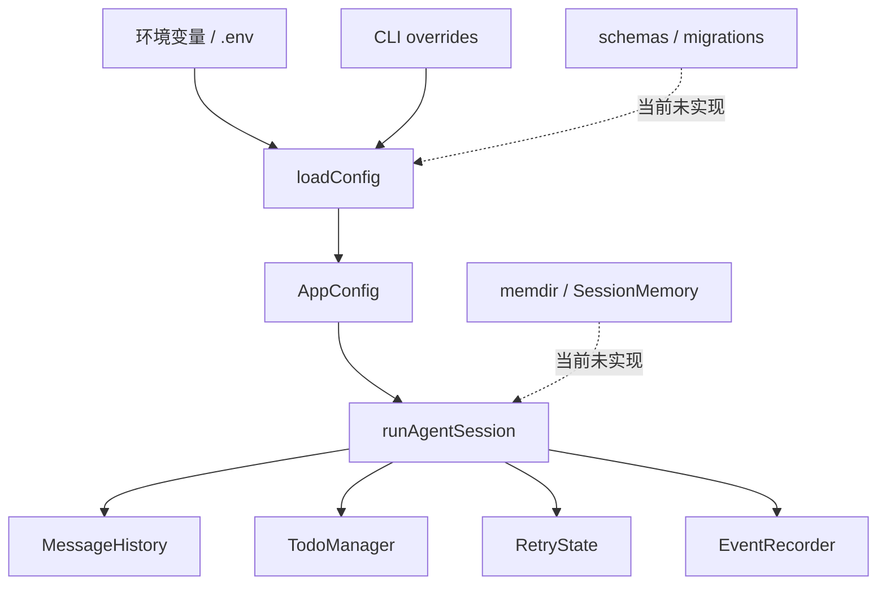

# State / Memory / Config：配置优先级、会话状态和长期记忆边界

## 学习目标

这篇模块笔记关注 Claude Code 的 state、memdir、SessionMemory、settings 和 migrations，以及当前 `coding-agent` 的配置和短期状态。重点回答：

- 配置、会话状态、长期记忆和 settings sync 是不同层次的问题。
- 当前 `config.ts` 已经有哪些校验和优先级规则？
- 为什么当前项目不能把 TODO、trace 或压缩摘要描述成长期记忆？

## 模块图示



## 参考文件

Claude Code：

- `<claude-code-snapshot>/src/state/`
- `<claude-code-snapshot>/src/memdir/`
- `<claude-code-snapshot>/src/services/SessionMemory/`
- `<claude-code-snapshot>/src/services/extractMemories/`
- `<claude-code-snapshot>/src/services/settingsSync/`
- `<claude-code-snapshot>/src/schemas/`
- `<claude-code-snapshot>/src/migrations/`
- `<claude-code-snapshot>/src/bootstrap/state.ts`

coding-agent：

- `src/config.ts`
- `src/session.ts`
- `src/context/message-history.ts`
- `src/context/compressor.ts`
- `src/planning/todo.ts`
- `src/observability/events.ts`
- `docs/plan/p6-session-persistence.md`
- `docs/plan/p12-config-policy-governance.md`
- `tests/config.test.ts`

## Claude Code 模块职责

Claude Code 的状态和配置系统覆盖：

- AppState 和 UI state。
- 会话状态和恢复。
- memdir 长期记忆扫描。
- SessionMemory 和 memory 提取。
- settings sync。
- schema 校验。
- migrations。
- managed settings / policy。
- 插件、MCP、权限和模型相关配置。

这些模块的共同难点是生命周期不同：有的只在一次 query 内有效，有的跨会话，有的跨项目，有的来自远程策略。

## coding-agent 配置细节

`AppConfig` 包含：

- `apiKey`
- `baseURL`
- `model`
- `maxTurns`
- `workingDirectory`
- `autoApprove`
- `testCommand`
- `maxRetries`
- `verbose`
- `hooksConfigPath`
- `observability`

关键规则：

- `loadDotenv()` 读取 `.env`。
- `ARK_API_KEY` 必填。
- `ARK_MODEL` 必填。
- `BASE_URL` 默认 `https://ark.cn-beijing.volces.com/api/v3`。
- `MAX_TURNS` 默认 20，必须是正整数。
- `MAX_RETRIES` 默认 3，必须是正整数。
- `workingDirectory` 默认 `process.cwd()`。
- CLI overrides 优先于环境变量。
- boolean 只把 `"1"` 或 `"true"` 当成 true。

Observability 配置：

- `OBSERVABILITY_DIR` 默认 `.coding-agent/observability`。
- feedback URL 存在时启用 feedback。
- OTEL 可以通过专用 endpoint 或通用 OTLP endpoint 推导 `/v1/traces`。
- timeout 和 batchSize 都做正整数校验。

## 当前短期状态

当前项目有这些短期状态：

- `MessageHistory`：本次 Agent Loop 的消息历史。
- `TodoManager`：当前任务规划状态。
- `RetryState`：编辑后验证重试状态。
- `EventRecorder` queue：本次 run 的事件队列。
- TUI state：输入、消息列表、权限 prompt、运行状态。

它们都不是长期记忆。

## 当前没有的能力

当前项目没有：

- AppState Store。
- settings schema 文件。
- migrations。
- settings sync。
- memdir。
- SessionMemory。
- memory extraction。
- managed policy。
- workspace trust。
- 真正 RAG。

P6 和 P12 分别规划了会话持久化与配置策略治理，但尚未落地。

## 数据流 / 控制流

当前配置链路：

```text
runCli(argv)
-> parseCliArgs()
-> loadConfig(overrides)
-> env + overrides + defaults + validation
-> createDefaultToolRegistry(config.workingDirectory)
-> runAgentSession()
-> runAgentLoop()
```

当前状态链路：

```text
runAgentSession()
-> createEventRecorder(runId)
-> runAgentLoop()
-> MessageHistory / TodoManager / Harness RetryState
-> SessionEnd
-> recorder.flush() / close()
```

## 敏感信息边界

配置中的敏感信息包括：

- `ARK_API_KEY`
- Authorization header
- token
- password
- secret
- credential
- env dump

`src/observability/events.ts` 会按 key pattern 和字符串 pattern 脱敏。但配置层仍必须避免把密钥写入文档、prompt、trace payload 或 hook payload。

## 与 Claude Code 的关键差异

Claude Code 的状态系统是产品级：

- 多来源 settings。
- 长期记忆。
- schema/migration。
- 远程或托管设置。
- 插件和权限配置治理。

当前 `coding-agent` 是运行时配置 + 短期状态：

- 配置从 env/overrides 读取。
- 没有配置文件。
- 没有迁移。
- 没有长期记忆。
- 没有设置同步。

## 测试证据

当前关键测试：

- `tests/config.test.ts`：必填、默认、override、非法值、observability。
- `tests/context/message-history.test.ts`：消息历史状态。
- `tests/planning/todo.test.ts`：TODO 状态。
- `tests/verification/retry-loop.test.ts`：验证重试状态。
- `tests/observability/events.test.ts`：脱敏和 schema。

## 可以借鉴的设计

- P12 应从非敏感项目配置开始，明确 env / CLI / project config 优先级。
- 任何新配置字段必须同时覆盖 override、env、非法值和默认值测试。
- P6 会话持久化应保存协议消息，并考虑迁移。
- 长期 memory 如果实现，必须和工具结果、摘要、TODO 分层。

## 不应该照搬的设计

- 不应把当前 TODO 状态或 trace 写成 memory。
- 不应引入静默默认模型。
- 不应在没有 schema/migration 前保存复杂长期状态。
- 不应把 Claude Code 的 settings sync 或 managed policy 写成本项目现状。
