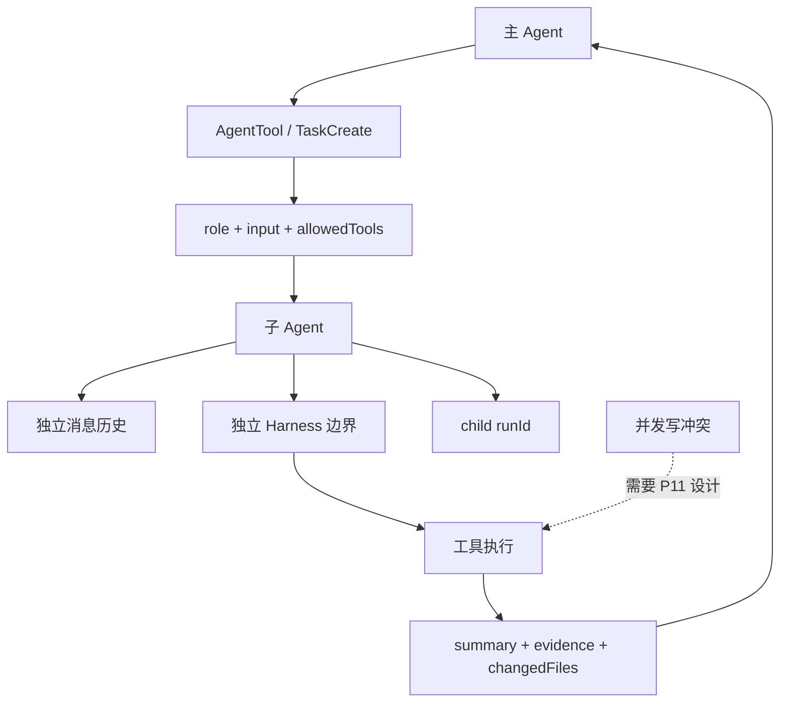

# Task / AgentTool：子任务、独立历史与结果摘要

## 学习目标

这篇模块笔记关注 Claude Code 的 Task 系统和 AgentTool。重点回答：

- 子 Agent 和普通工具调用有什么技术差异？
- 独立消息历史、角色、工具范围和结果摘要为什么重要？
- 当前 `coding-agent` 的 P11 应如何复用现有 Agent Loop 和 Harness？

## 模块图示



## 参考文件

Claude Code：

- `<claude-code-snapshot>/src/tasks.ts`
- `<claude-code-snapshot>/src/Task.ts`
- `<claude-code-snapshot>/src/tasks/`
- `<claude-code-snapshot>/src/tools/AgentTool/`
- `<claude-code-snapshot>/src/utils/tasks.ts`
- `<claude-code-snapshot>/src/utils/swarm/`

coding-agent：

- `src/agent-loop.ts`
- `src/harness.ts`
- `src/context/message-history.ts`
- `src/observability/events.ts`
- `docs/plan/p11-multi-agent-orchestration.md`

## Claude Code 模块职责

Claude Code 的 Task / AgentTool 体系用于把主会话中的复杂问题拆给子任务执行。相关模块通常要处理：

- 子 Agent 类型和内置角色。
- Agent 目录加载。
- fork / resume 子 Agent。
- 子 Agent 独立上下文和 memory snapshot。
- 子 Agent 工具范围。
- 子任务 UI 展示和颜色管理。
- 结果摘要和输出格式。
- in-process、remote、tmux、iTerm 等执行后端。
- swarm / teammate 模式中的权限同步和重连。

这已经超出“调用另一个函数”的范畴，属于多运行时协调。

## 子 Agent 和普通工具的差异

普通工具：

- 输入是 JSON。
- 执行一次。
- 返回 tool result。
- 不拥有多轮模型历史。

子 Agent：

- 输入是任务说明、角色和上下文。
- 内部可能跑多轮 Agent Loop。
- 有独立消息历史。
- 有独立工具权限范围。
- 可能修改文件、运行命令和产生 trace。
- 返回摘要、证据、产物路径和错误。

所以子 Agent 更像“嵌套会话”，不是普通工具。

## Claude Code 典型链路

```text
主 Agent 判断任务可拆分
-> 调 AgentTool
-> 加载目标 agent 定义或内置角色
-> 构造子 Agent 输入、上下文、工具范围
-> fork 或创建任务
-> 子 Agent 独立运行
-> 收集进度、工具结果和最终摘要
-> 主 Agent 接收摘要并继续决策
```

## coding-agent 当前状态

当前项目没有：

- `AgentTool`。
- 子 Agent 协议。
- 并发任务执行。
- 子 Agent 独立历史。
- 结果摘要协议。
- swarm / teammate / remote backend。

当前已有可复用构件：

- `runAgentLoop()`：可作为子 Agent 内部循环。
- `MessageHistory`：可为每个子 Agent 独立创建。
- `Harness`：可为每个子 Agent 复用权限、安全和验证。
- `EventRecorder`：可用 runId 或 parentId 关联主子任务。
- `ToolRegistry`：可为子 Agent 限制工具范围。

## P11 最小设计建议

P11 可从以下协议开始：

```ts
interface SubAgentSpec {
  role: string;
  input: string;
  allowedTools: string[];
  workingDirectory: string;
}

interface SubAgentResult {
  success: boolean;
  summary: string;
  evidence: string[];
  changedFiles: string[];
  runId: string;
}
```

关键原则：

- 子 Agent 必须独立 `MessageHistory`。
- 子 Agent 必须复用 Harness。
- 主 Agent 不接收完整子 Agent 历史，只接收摘要和证据。
- 并发写入前必须定义 disjoint write set 或工作区隔离。
- 子 Agent 失败必须结构化返回，不应让主循环直接崩溃。

## 并发风险

多 Agent 最容易出问题的地方：

- 两个子 Agent 修改同一文件。
- 子 Agent 和主 Agent 同时修改工作区。
- 子 Agent 读取过期上下文。
- 子 Agent 摘要遗漏关键错误。
- 权限确认归属不清。
- trace 无法关联，复盘困难。

所以 P11 首版应保守：先串行或限制写范围，再考虑并发。

## 与 Claude Code 的关键差异

Claude Code 已有复杂任务和多后端基础；当前项目仍是单 Agent：

- 无子任务 UI。
- 无 agent 目录。
- 无 resume agent。
- 无 remote teammate。
- 无权限同步。
- 无多 Agent 冲突处理。

当前要学习的是边界，而不是直接复刻复杂协调器。

## 测试策略建议

P11 如果实现，应补：

- 子 Agent 拥有独立消息历史。
- 子 Agent 复用 Harness，不能直接调用 registry。
- 工具范围限制生效。
- 子 Agent 失败返回结构化结果。
- 主 Agent 只接收摘要，不接收完整历史。
- 并发写同文件被拒绝或隔离。
- observability 能关联 parent/child runId。

## 可以借鉴的设计

- 子 Agent 角色定义独立维护。
- 子 Agent 结果必须摘要化、可引用证据。
- 权限和工具范围要显式传入。
- 任务 UI 和 trace 要能展示子任务状态。

## 不应该照搬的设计

- 不应在当前阶段实现 swarm、多后端或远程 teammate。
- 不应把子 Agent 当作普通函数调用，忽略历史和权限隔离。
- 不应为了并行而拆分阻塞主路径的紧耦合任务。
- 不应把多 Agent 能力写成当前已实现。
