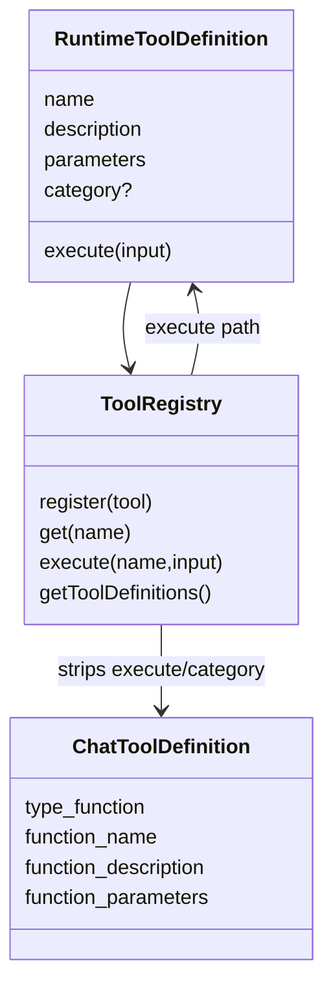

# Tool 类型与注册：模型 schema 和运行时 execute 的分离

## 学习目标

这篇模块笔记关注 Claude Code 的 `Tool.ts` / `tools.ts` 与当前 `coding-agent` 的工具类型、注册表和 schema 导出。重点回答：

- 为什么 `src/types.ts` 和 `src/tools/types.ts` 必须分离？
- `ToolRegistry.getToolDefinitions()` 到底能暴露什么？
- 工具注册、执行和测试应如何防止运行时字段泄露给模型？

## 模块图示



## 参考文件

Claude Code：

- `<claude-code-snapshot>/src/Tool.ts`
- `<claude-code-snapshot>/src/tools.ts`
- `<claude-code-snapshot>/src/constants/tools.ts`
- `<claude-code-snapshot>/src/tools/`
- `<claude-code-snapshot>/src/utils/toolSchemaCache.ts`
- `<claude-code-snapshot>/src/utils/toolSearch.ts`

coding-agent：

- `src/types.ts`
- `src/tools/types.ts`
- `src/tools/index.ts`
- `src/tools/*.ts`
- `tests/tools/registry-integration.test.ts`
- `tests/tools/index.test.ts`

## Claude Code 模块职责

Claude Code 的 Tool 层承载更多运行时信息。一个工具不仅有模型可见名称、描述和输入 schema，还可能包含：

- 输入校验和 schema 转换。
- 权限上下文。
- UI 展示组件。
- tool result 渲染。
- 并发、只读、危险等级或 sandbox 提示。
- MCP、Skill、Plugin 等动态来源。
- 工具搜索、工具过滤和 schema cache。

这类工具对象不能原样交给模型。模型只能看到符合模型 API 的 tool schema；权限、执行函数、UI 和内部状态必须留在运行时。

## coding-agent 模块职责

当前项目把工具协议拆成两层。

`src/types.ts` 表达 LLM API 消息协议：

- `Role`
- `ToolCall`
- `Message`
- `ToolDefinition`
- `ChatCompletionRequest`
- `ChatCompletionResponse`
- `ParsedToolCall`
- `ParsedResponse`

这里的 `ToolDefinition` 是 OpenAI-compatible schema：

```ts
{
  type: "function",
  function: {
    name: string,
    description: string,
    parameters: Record<string, unknown>
  }
}
```

`src/tools/types.ts` 表达运行时工具协议：

```ts
{
  name: string,
  description: string,
  parameters: Record<string, unknown>,
  execute(input): Promise<ToolResult>,
  category?: RegisteredToolCategory
}
```

运行时工具多了两个模型不应看到的字段：

- `execute`：真实执行函数。
- `category`：权限分类，服务 Harness 和 permission。

## ToolRegistry 技术细节

`ToolRegistry` 内部使用 `Map<string, ToolDefinition>` 存储工具：

- `register(tool)`：重复名称直接抛错。
- `get(name)`：查运行时工具。
- `getAll()`：返回运行时工具列表。
- `execute(name, input)`：找不到工具抛 `Tool not found`，找到后调用 `tool.execute(input)`。
- `getToolDefinitions()`：把运行时工具映射成模型可见 schema。
- `getTodoManager()`：给 Agent Loop 注入 TODO 状态。

`getToolDefinitions()` 的关键代码形态是：

```ts
return this.getAll().map((tool) => ({
  type: "function",
  function: {
    name: tool.name,
    description: tool.description,
    parameters: tool.parameters,
  },
}));
```

它故意不返回 `execute`、`category` 或其他运行时字段。

## 默认工具注册

`createDefaultToolRegistry(workingDirectory, todoManager)` 注册：

- `read_file`
- `write_file`
- `edit_file`
- `run_command`
- `grep`
- `glob`
- `todo_write`

这些工具都接受 `workingDirectory` 或共享的 `TodoManager`。这保证文件和命令工具的执行上下文来自创建 registry 时的工作目录，而不是工具自己读取环境变量。

## 数据流 / 控制流

```text
createDefaultToolRegistry(cwd)
-> register(runtime ToolDefinition)
-> Agent Loop 调 getToolDefinitions()
-> LLMClient 把 OpenAI-compatible schema 放入 chat/completions
-> 模型返回 tool_calls
-> Agent Loop 调 Harness.executeTool(name, input, registry)
-> Harness 做安全、权限、验证
-> ToolRegistry.execute(name, input)
-> runtime tool.execute(input)
-> ToolResult 被格式化为 tool message
```

## 失败路径细节

- 重复注册：`register()` 抛 `Tool already registered`。
- 未知工具：`execute()` 抛 `Tool not found`，由 Harness 捕获并转成 `[error] Tool not found`。
- 参数解析失败：在 `parseResponse()` 阶段显式抛错，不在 registry 静默兜底。
- 工具内部输入校验失败：工具自己返回 `ToolResult.error`，Harness 格式化后回传模型。

注意：各工具返回的 `ToolResult.tool_call_id` 是工具名常量，但 Agent Loop 回传 `role: "tool"` 时使用的是模型返回的真实 `call.id`。工具内部的 `tool_call_id` 不应作为消息协议 id。

## 测试证据

当前关键测试覆盖：

- `tests/tools/registry-integration.test.ts`：默认工具注册、schema 导出、运行时字段不泄露。
- `tests/tools/index.test.ts`：注册、重复注册、执行和错误路径。
- 各 `tests/tools/*.test.ts`：单工具参数校验和行为。
- `tests/agent-loop.test.ts`：真实 tool call id 回传和 Harness 边界。

## 与 Claude Code 的关键差异

Claude Code 的工具对象通常要服务模型、权限、UI、运行时、动态来源和结果展示。当前 `coding-agent` 刻意保持较小对象：

- 模型协议在 `src/types.ts`。
- 运行时协议在 `src/tools/types.ts`。
- 权限和验证在 Harness。
- UI 在 CLI/TUI 层。
- 动态扩展仍在 P10 规划中。

这个分离让学习版更容易测试和审计，也避免模型看到运行时能力。

## 可以借鉴的设计

- 未来 P10 做 MCP / 插件式工具时，仍应先转成当前运行时 `ToolDefinition`，再由 registry 导出模型 schema。
- 可以增加工具来源 metadata，但不应默认暴露给模型。
- 可以增加 schema cache 或工具过滤，但测试必须继续断言运行时字段不泄露。

## 不应该照搬的设计

- 不应把 Claude Code 的 UI、权限、动态来源、插件治理全部塞进当前 `ToolDefinition`。
- 不应让工具实现自己读取 API key 或绕过 `workingDirectory`。
- 不应让模型看到 `execute`、`category`、权限策略或内部路径。
